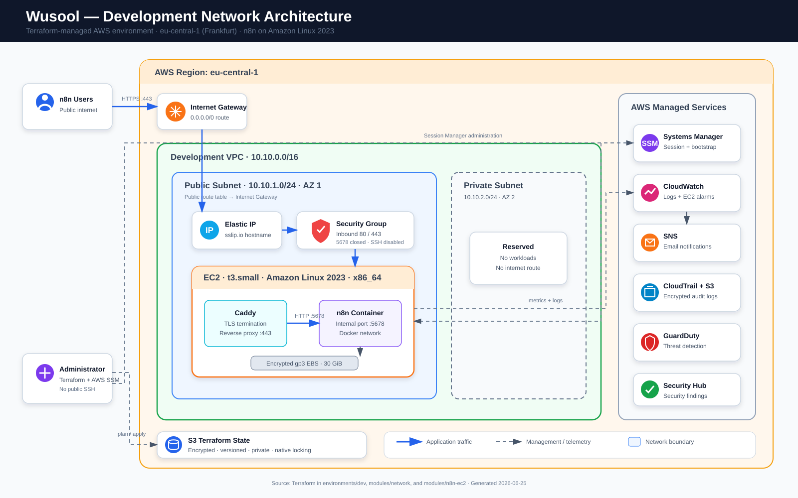
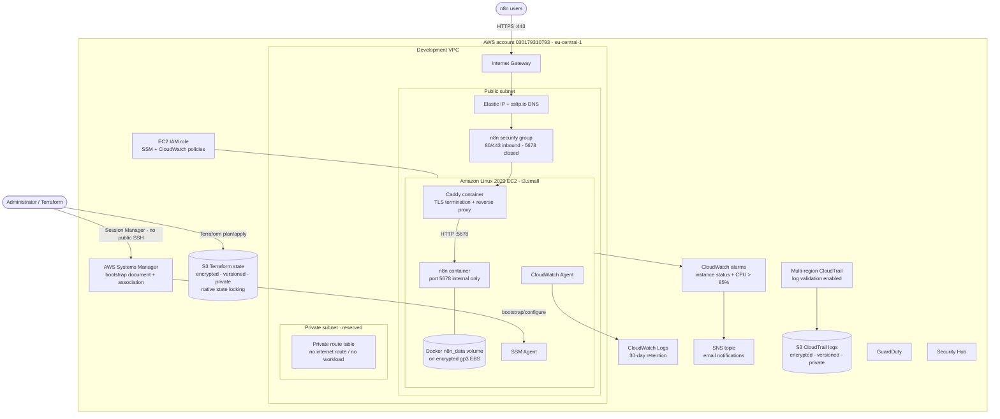
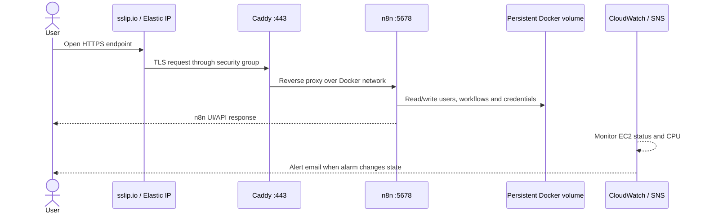

# Wusool n8n Development Infrastructure

This diagram is derived from the Terraform in `environments/dev`,
`modules/network`, `modules/n8n-ec2`, and `bootstrap-frankfurt`.

For a Markdown-only version, see
[Wusool development network diagram](wusool-dev-network-diagram.md).

## Request and operations flow

## Security boundaries

- Only HTTP and HTTPS are normally public; n8n port `5678` is not exposed.
- Administration uses AWS Systems Manager. Public SSH is disabled when
  `ssh_cidr_blocks` is empty, as in the supplied development configuration.
- The EC2 root disk, Terraform state, and CloudTrail logs are encrypted.
- Instance Metadata Service v2 tokens are required.
- The private subnet currently has no workload and no outbound internet route.
- GuardDuty, Security Hub, CloudTrail, CloudWatch alarms, and SNS provide
  detection, audit, monitoring, and notification coverage.
