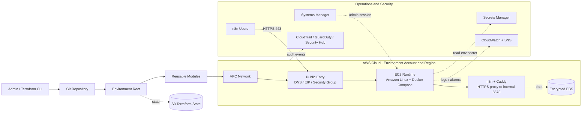
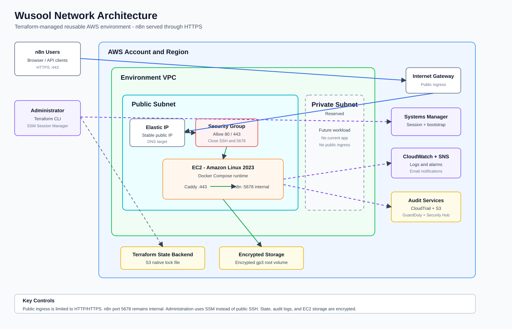
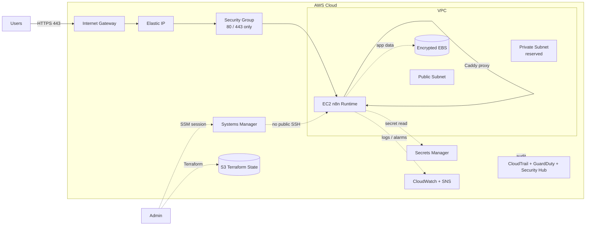

# Wusool Infrastructure Overview

This document explains the reusable Terraform architecture for Wusool n8n
environments. It is written for both development and production discussions:
the same modules and deployment flow are used, while each environment keeps its
own variables, backend state, network ranges, instance size, and domain.

## 1. Executive Summary

Wusool infrastructure is managed as code with Terraform. The repository defines:

- A one-time `bootstrap` stack for Terraform remote state.
- Environment roots under `environments/`, such as `dev` and `prod`.
- Reusable modules under `modules/` for networking and the n8n EC2 runtime.
- Operational controls for secure administration, monitoring, alerting, and
  audit services.
- A Secrets Manager secret per environment for n8n runtime secrets, with
  environment-scoped EC2 read access, including optional SMTP settings.

The target architecture is:

```text
Git repository
-> Terraform environment root
-> reusable modules
-> AWS network and n8n runtime
-> S3 state, SSM access, Secrets Manager, CloudWatch/SNS, CloudTrail/GuardDuty/Security Hub
```

Development currently includes the full monitoring and audit stack in Terraform.
Production is present as an environment template and should use its own backend
state and matching operational controls before a real production rollout.

## 2. Architecture Diagram

The editable draw.io source is:

```text
DOCS/n8n/wusool-infrastructure-architecture.drawio
```

Open it in Cursor with `Open With -> Draw.io Editor`, or open it from
https://app.diagrams.net using `Device -> Open Existing Diagram`.

High-level flow:



## 3. Network Diagram



The network diagram shows the same idea in a simpler network-focused view:



## 4. Repository Structure

```text
wusool-infra/
|-- bootstrap/                 # Creates Terraform backend resources
|-- environments/
|   |-- dev/                   # Development root configuration
|   `-- prod/                  # Production root/template configuration
|-- modules/
|   |-- network/               # VPC, subnets, route tables, internet gateway
|   `-- n8n-ec2/               # EC2, Caddy, n8n, IAM, SSM, logs, alarms
|-- DOCS/                      # Documentation and diagrams
|-- scripts/                   # Helper scripts
`-- .agents/skills/            # Project-local Codex skills
```

## 5. Terraform Root Files

Terraform does not execute a single file. When run inside an environment folder,
it loads all `.tf` files in that folder as one configuration.

| File | Purpose |
| --- | --- |
| `backend.tf` | Configures the S3 remote state backend for that environment |
| `providers.tf` | Configures the AWS provider, region, and default tags |
| `main.tf` | Calls modules and defines environment-level services |
| `variables.tf` | Declares configurable inputs |
| `terraform.tfvars` | Supplies local values; ignored by Git |
| `outputs.tf` | Prints useful values such as URL, public IP, and SSM command |

Common workflow:

```powershell
Set-Location environments/dev   # or environments/prod
terraform init
terraform fmt -check
terraform validate
terraform plan -out=tfplan
terraform apply tfplan
```

## 6. Environment Model

Each environment should have its own:

- Terraform backend state key.
- AWS region.
- VPC and subnet CIDR ranges.
- Domain/webhook URL.
- Instance size and disk size.
- Alerting contacts.
- Security decisions such as SSH access and direct n8n port exposure.

Current code pattern:

| Environment | Purpose | Notes |
| --- | --- | --- |
| `environments/dev` | Active non-production root | Includes network, n8n EC2, SNS alerts, CloudTrail, GuardDuty, and Security Hub |
| `environments/prod` | Production template/root | Uses network and n8n modules; should be reviewed and brought to operational parity before real production apply |

Important rule:

```text
Do not deploy production by only changing TF_VAR_environment while still using
the development backend. Prod must use its own backend state.
```

## 7. Bootstrap And Terraform State

`bootstrap/` creates backend resources used by Terraform state:

- S3 bucket for remote state.
- S3 versioning.
- Server-side encryption.
- Public access blocking.
- DynamoDB lock table is present in bootstrap code for compatibility/history,
  while the active dev backend uses S3 native lock file.

The normal application infrastructure is not applied from `bootstrap/`.
Bootstrap is for state storage; environments are for actual n8n infrastructure.

Demo line:

```text
Bootstrap prepares Terraform's remote state storage. Each environment then uses
its own state key so dev and prod do not overwrite each other.
```

## 8. Network Module

`modules/network` creates the AWS network foundation:

- VPC.
- Public subnet.
- Private subnet.
- Internet Gateway.
- Public route table.
- Private route table.
- Route table associations.

Explanation:

```text
The VPC is the isolated AWS network. The public subnet hosts internet-facing
entry points. The private subnet is reserved for future private workloads.
The Internet Gateway and route table allow controlled public web traffic.
```

## 9. n8n EC2 Module

`modules/n8n-ec2` creates the application runtime:

- Latest Amazon Linux 2023 AMI lookup.
- EC2 security group.
- IAM role and instance profile.
- SSM permissions for Session Manager access.
- CloudWatch permissions and log group.
- Optional Secrets Manager read policy for environment-scoped secrets.
- Elastic IP.
- EC2 instance.
- SSM bootstrap document and association.
- CloudWatch status and CPU alarms.
- n8n URL and access outputs.

Runtime setup is driven by:

```text
modules/n8n-ec2/user_data.sh.tpl
```

That template installs and starts the runtime pieces, including Docker Compose,
Caddy, n8n, and optional SMTP configuration loaded from Secrets Manager.

## 10. Request Flow

User traffic follows this path:

```text
User browser/API
-> HTTPS 443
-> DNS and Elastic IP
-> Security Group
-> EC2
-> Caddy
-> n8n internal port 5678
```

Security point:

```text
The public security group allows web traffic on 80/443. The n8n application
port 5678 stays internal unless explicitly enabled for troubleshooting.
```

## 11. Caddy And n8n

Caddy is the secure front door for n8n.

It handles:

- HTTP to HTTPS redirect.
- TLS certificate handling.
- Reverse proxying.
- Forwarding traffic to n8n internally.

n8n listens internally on port `5678`. Users access HTTPS on port `443`, and
Caddy forwards the request inside the host/container network.

Demo line:

```text
Caddy receives secure HTTPS traffic and proxies it internally to n8n, so the
n8n application port does not need to be public.
```

## 12. Secrets Manager

Each environment root declares one AWS Secrets Manager secret for n8n:

```text
/${project}/${environment}/n8n
```

Terraform creates the secret container and grants the n8n EC2 role
`secretsmanager:DescribeSecret` and `secretsmanager:GetSecretValue` for only
that environment's secret ARN. Secret values should be inserted after apply
with AWS CLI or the AWS console, not committed to Git or managed as Terraform
secret versions.

Optional SMTP email settings and runtime secrets use these JSON keys:

```json
{
  "smtp_host": "smtp.example.com",
  "smtp_port": 587,
  "smtp_user": "user@example.com",
  "smtp_password": "replace-me",
  "smtp_sender": "Wusool <no-reply@example.com>",
  "smtp_ssl": false,
  "env": {
    "GEMINI_API_KEY": "replace-me",
    "SLACK_WEBHOOK_CI": "https://hooks.slack.com/services/replace-me",
    "SLACK_WEBHOOK_ALERTS": "https://hooks.slack.com/services/replace-me"
  }
}
```

When `smtp_host` is present, the n8n bootstrap writes `/opt/n8n/n8n.env` and
passes the values to the container as `N8N_EMAIL_MODE=smtp` and `N8N_SMTP_*`
variables. Any key/value pairs under `env` are appended to the same env file and
passed through to the n8n container. Use the dev secret for development and the
prod secret for production so credentials stay environment-scoped.

SMTP also enables n8n user invitation emails and forgot-password/reset emails.
Without SMTP, users can be created only through an admin-mediated flow and they
cannot self-serve password resets.

## 13. Encrypted EBS

The EC2 root volume is encrypted gp3 EBS storage.

It provides:

- Persistent storage for the runtime.
- Data at rest encryption.
- Storage that remains available across normal instance stop/start cycles.

Demo line:

```text
EC2 runs the application, and encrypted EBS provides protected persistent disk
storage for the runtime.
```

## 14. Systems Manager

AWS Systems Manager Session Manager is the preferred admin path.

It avoids exposing SSH publicly:

```text
Admin
-> AWS Systems Manager
-> EC2 instance
```

For this to work, the EC2 instance has:

- IAM role.
- SSM managed policy.
- SSM agent from Amazon Linux.
- SSM bootstrap association.

Example:

```powershell
aws ssm start-session --target <instance-id> --region <aws-region>
```

## 15. Monitoring And Alerts

Monitoring is handled by CloudWatch and SNS.

CloudWatch provides:

- Log group for n8n/runtime logs.
- EC2 status-check alarm.
- High CPU alarm.

SNS provides:

- Email notification delivery when alarms publish to the topic.

In the current Terraform code, the full SNS alert topic and subscription are
defined in the development root. Production should use equivalent alerting
before real production use.

## 16. Audit And Security

Audit and security services include:

- CloudTrail for AWS API audit history.
- Encrypted and versioned S3 bucket for CloudTrail logs.
- GuardDuty for threat detection.
- Security Hub for centralized security findings.

In the current Terraform code, these services are defined in the development
root. Production should use the same or stricter controls before production
deployment.

## 17. What Terraform Apply Does

When you run `terraform apply` from an environment folder:

1. Terraform reads all `.tf` files in that folder.
2. It loads variable values from `terraform.tfvars` and environment variables.
3. It connects to the S3 backend and reads current state.
4. It calls reusable modules.
5. It compares desired code with real AWS resources.
6. It shows a plan.
7. After approval, it creates, updates, or deletes only what the plan requires.
8. It writes the updated state back to S3.

Demo line:

```text
Terraform apply compares code against AWS, performs the required changes, and
updates the remote state so future plans know what exists.
```

## 18. Safety Rules

- Do not edit `terraform.tfstate` manually.
- Do not commit `.terraform/`, state files, plan files, credentials, or local
  `terraform.tfvars`.
- Do not commit secret values or manage secret versions in Terraform state.
- Keep dev and prod on separate backend state keys.
- Review every plan before apply.
- Stop and investigate any unexpected destroy or EC2/EIP/VPC replacement.
- Do not run `terraform destroy` in `bootstrap/` unless intentionally removing
  backend infrastructure.

## 19. Short Demo Talk Track

```text
This repository manages Wusool n8n infrastructure using Terraform. The code is
stored in Git. Each environment has its own root configuration and backend
state. The root calls reusable modules: one module creates the VPC, subnets,
routes, and Internet Gateway; the other creates the EC2 runtime, Caddy, n8n,
IAM, SSM access, EBS storage, logs, and alarms.

Users access n8n through HTTPS. Public access is limited by the security group.
Caddy receives HTTPS and proxies internally to n8n on port 5678. Administration
uses Systems Manager instead of public SSH. Each environment has its own
Secrets Manager secret, and the EC2 role can read only that environment's
secret. CloudWatch and SNS handle logs and alerts, while CloudTrail, GuardDuty,
and Security Hub provide audit and security visibility.
```
