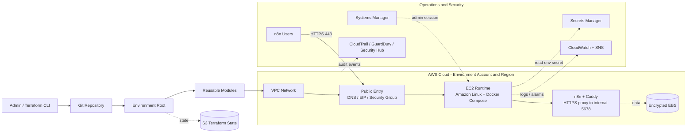
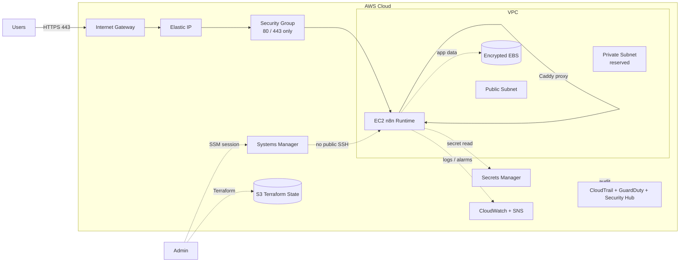

# Wusool Infrastructure Overview

This document explains the reusable Terraform architecture for Wusool n8n
environments. It is written for both development and production discussions:
the same modules and deployment flow are used, while each environment keeps its
own variables, backend state, network ranges, instance size, and domain.

## 1. Executive Summary

Wusool infrastructure is managed as code with Terraform. The repository defines:

- A one-time `bootstrap` stack for Terraform remote state.
- Environment roots under `environments/`, such as `dev` and `prod`.
- Reusable modules under `terraform/modules/` for networking and the n8n EC2 runtime.
- Operational controls for secure administration, monitoring, alerting, and
  audit services.
- A Secrets Manager secret per environment for n8n runtime secrets, with
  environment-scoped EC2 read access, including optional SMTP settings.

The target architecture is:

```text
Git repository
-> Terraform environment root
-> reusable modules
-> AWS network and n8n runtime
-> S3 state, SSM access, Secrets Manager, CloudWatch/SNS, CloudTrail/GuardDuty/Security Hub
```

Development currently includes the full monitoring and audit stack in Terraform.
Production is present as an environment template and should use its own backend
state and matching operational controls before a real production rollout.

## 2. Architecture Diagram

The editable draw.io source is:

```text
DOCS/n8n/wusool-infrastructure-architecture.drawio
```

Open it in Cursor with `Open With -> Draw.io Editor`, or open it from
https://app.diagrams.net using `Device -> Open Existing Diagram`.

High-level flow:



## 3. Network Diagram


The network diagram shows the same idea in a simpler network-focused view:



## 4. Repository Structure

```text
wusool-infra/
|-- terraform/                 # All Terraform configuration
|   |-- bootstrap/             # Creates Terraform backend resources
|   |-- environments/
|   |   |-- dev/               # Development root configuration
|   |   `-- prod/              # Production root/template configuration
|   `-- modules/
|       |-- network/           # VPC, subnets, route tables, internet gateway
|       `-- n8n-ec2/           # EC2, Caddy, n8n, IAM, SSM, logs, alarms
|-- DOCS/                      # Documentation and diagrams
|-- scripts/                   # Helper scripts
`-- .agents/skills/            # Project-local Codex skills
```

## 5. Terraform Root Files

Terraform does not execute a single file. When run inside an environment folder,
it loads all `.tf` files in that folder as one configuration.

| File | Purpose |
| --- | --- |
| `backend.tf` | Configures the S3 remote state backend for that environment |
| `providers.tf` | Configures the AWS provider, region, and default tags |
| `main.tf` | Calls modules and defines environment-level services |
| `variables.tf` | Declares configurable inputs |
| `terraform.tfvars` | Supplies local values; ignored by Git |
| `outputs.tf` | Prints useful values such as URL, public IP, and SSM command |

Common workflow:

```powershell
Set-Location terraform/environments/dev   # or terraform/environments/prod
terraform init
terraform fmt -check
terraform validate
terraform plan -out=tfplan
terraform apply tfplan
```

## 6. Environment Model

Each environment should have its own:

- Terraform backend state key.
- AWS region.
- VPC and subnet CIDR ranges.
- Domain/webhook URL.
- Instance size and disk size.
- Alerting contacts.
- Security decisions such as SSH access and direct n8n port exposure.

Current code pattern:

| Environment | Purpose | Notes |
| --- | --- | --- |
| `terraform/environments/dev` | Active non-production root | Includes network, n8n EC2, SNS alerts, CloudTrail, GuardDuty, and Security Hub |
| `terraform/environments/prod` | Production template/root | Uses network and n8n modules; should be reviewed and brought to operational parity before real production apply |

Important rule:

```text
Do not deploy production by only changing TF_VAR_environment while still using
the development backend. Prod must use its own backend state.
```

## 7. Bootstrap And Terraform State

`terraform/bootstrap/` creates backend resources used by Terraform state:

- S3 bucket for remote state.
- S3 versioning.
- Server-side encryption.
- Public access blocking.
- DynamoDB lock table is present in bootstrap code for compatibility/history,
  while the active dev backend uses S3 native lock file.

The normal application infrastructure is not applied from `terraform/bootstrap/`.
Bootstrap is for state storage; environments are for actual n8n infrastructure.

Demo line:

```text
Bootstrap prepares Terraform's remote state storage. Each environment then uses
its own state key so dev and prod do not overwrite each other.
```

## 8. Network Module

`terraform/modules/network` creates the AWS network foundation:

- VPC.
- Public subnet.
- Private subnet.
- Internet Gateway.
- Public route table.
- Private route table.
- Route table associations.

Explanation:

```text
The VPC is the isolated AWS network. The public subnet hosts internet-facing
entry points. The private subnet is reserved for future private workloads.
The Internet Gateway and route table allow controlled public web traffic.
```

## 9. n8n EC2 Module

`terraform/modules/n8n-ec2` creates the application runtime:

- Latest Amazon Linux 2023 AMI lookup.
- EC2 security group.
- IAM role and instance profile.
- SSM permissions for Session Manager access.
- CloudWatch permissions and log group.
- Optional Secrets Manager read policy for environment-scoped secrets.
- Elastic IP.
- EC2 instance.
- SSM bootstrap document and association.
- CloudWatch status and CPU alarms.
- n8n URL and access outputs.

Runtime setup is driven by:

```text
terraform/modules/n8n-ec2/user_data.sh.tpl
```

That template installs and starts the runtime pieces, including Docker Compose,
Caddy, n8n, and optional SMTP configuration loaded from Secrets Manager.

### 9.1 External task runners (JavaScript and Python Code nodes)

The compose file runs a separate `task-runners` service (image
`n8nio/runners:latest`) alongside `n8n`, connected via
`N8N_RUNNERS_TASK_BROKER_URI=http://n8n:5679`. That container runs a compiled
Go `task-runner-launcher` binary that spawns the actual JavaScript/Python
interpreter per task. The launcher reads its own config from a JSON file
(default `/etc/n8n-task-runners.json`, baked into the `n8nio/runners` image),
which declares, per runner type, an `allowed-env` allowlist of which
environment variables get forwarded to the spawned interpreter, plus an
`env-overrides` map that force-sets specific variables regardless of the
container's actual environment.

**Known n8n default gap (found 2026-08-08):** the image's default
`n8n-task-runners.json` does not include `N8N_RUNNERS_STDLIB_ALLOW` (or
`N8N_RUNNERS_EXTERNAL_ALLOW`, `N8N_BLOCK_RUNNER_ENV_ACCESS`) in the Python
runner's `allowed-env`, and additionally force-blanks
`N8N_RUNNERS_STDLIB_ALLOW`/`N8N_RUNNERS_EXTERNAL_ALLOW` via `env-overrides`.
This means setting those variables in the `n8n.env` secret-derived file has
**no effect** on Python Code nodes — every stdlib import gets rejected
("Security violations detected... Allowed stdlib modules: none") regardless
of what's configured. Confirmed present on n8n `2.27.5`; dev's older `2.26.8`
did not exhibit it, so this is very likely an n8n default that changed
between those versions, not a wusool-side misconfiguration.

**Fix:** the launcher supports `N8N_RUNNERS_CONFIG_PATH` to point at a custom
config file instead of the image default. `user_data.sh.tpl` now writes a
corrected `/opt/n8n/n8n-task-runners.json` (same as the image default, but
the Python runner's `allowed-env` gains `N8N_RUNNERS_STDLIB_ALLOW`,
`N8N_RUNNERS_EXTERNAL_ALLOW`, `N8N_BLOCK_RUNNER_ENV_ACCESS`, and its
`env-overrides` is emptied), and the `task-runners` service in the compose
template mounts it read-only to `/etc/n8n-task-runners-custom.json` and sets
`N8N_RUNNERS_CONFIG_PATH` to that path.

**Deployment status:** applied live directly on the `wusool-prod-n8n`
instance (`i-0087f9ecb02462b2e`, `eu-central-1`) via SSM on 2026-08-08 —
confirmed working. **Not yet applied to dev** (dev's older n8n version isn't
known to need it) and **not yet reconciled through Terraform** — see
section 18, "Known Infrastructure Gaps", below.

## 10. Request Flow

User traffic follows this path:

```text
User browser/API
-> HTTPS 443
-> DNS and Elastic IP
-> Security Group
-> EC2
-> Caddy
-> n8n internal port 5678
```

Security point:

```text
The public security group allows web traffic on 80/443. The n8n application
port 5678 stays internal unless explicitly enabled for troubleshooting.
```

## 11. Caddy And n8n

Caddy is the secure front door for n8n.

It handles:

- HTTP to HTTPS redirect.
- TLS certificate handling.
- Reverse proxying.
- Forwarding traffic to n8n internally.

n8n listens internally on port `5678`. Users access HTTPS on port `443`, and
Caddy forwards the request inside the host/container network.

Demo line:

```text
Caddy receives secure HTTPS traffic and proxies it internally to n8n, so the
n8n application port does not need to be public.
```

### 11.1 Prod dual-domain rename (2026-08-09)

Prod's public domain was renamed from `n8n-prod.wusoolcapital.com` to
`n8n.wusoolcapital.com` using a dual-domain approach: both hostnames stay
live simultaneously, so no existing workflow/webhook/OAuth URL broke.
Applied live via SSM to `wusool-prod-n8n` (`i-0087f9ecb02462b2e`):

- Cloudflare DNS: added an `A` record for `n8n.wusoolcapital.com` pointing
  at the same IP as the existing `n8n-prod` record, `DNS only` (not
  proxied), matching `n8n-prod`'s setting. The `wusoolcapital.com` zone
  lives under the `Jules@wusoolcapital...` Cloudflare account, not
  `Tech@wusoolcapital...`.
- `/opt/n8n/Caddyfile`: one site block now lists both hostnames
  (`n8n-prod.wusoolcapital.com, n8n.wusoolcapital.com { reverse_proxy
  n8n:5678 ... }`), so Caddy auto-provisions TLS for both and routes both
  identically.
- `/opt/n8n/docker-compose.yml`: `N8N_HOST` and `WEBHOOK_URL` now point at
  `n8n.wusoolcapital.com`. This only changes what URL n8n *generates* for
  newly created webhook/OAuth-callback nodes going forward — it does not
  gate whether the old domain keeps working, since n8n's incoming webhook
  routing is path-based, not Host-header-validated.
- Applying required two different restart mechanisms: `docker compose up -d`
  recreated the `n8n`/`task-runners` containers because their environment
  changed, but did **not** restart `caddy`, since Compose only recreates a
  container when its own declared config changes, not when a bind-mounted
  file's contents change. A separate `docker compose restart caddy` was
  needed for the new Caddyfile to take effect. Skipping that step is why
  `n8n.wusoolcapital.com` briefly returned a TLS handshake error
  (`SSL routines::tlsv1 alert internal error`) — Caddy was still serving its
  old single-domain config.
- Verified both `https://n8n-prod.wusoolcapital.com` and
  `https://n8n.wusoolcapital.com` return `HTTP/2 200` with valid TLS.

`Caddyfile.bak`/`docker-compose.yml.bak` (pre-change copies) were left on
the box under `/opt/n8n/`. This change is not yet reflected in the
`terraform/modules/n8n-ec2` Terraform template — prod is Terraform-orphaned (see
section 18) so the live box is unaffected either way, but the template
should adopt the same dual-domain pattern for future deployments/dev.

**Resolved 2026-08-10 — `n8n-prod.wusoolcapital.com` fully retired.** The
dual-domain period above was deliberately temporary. Before removing
anything, Caddy's access log was checked for real dependency on the old
domain and found active usage (21,320 log lines, 7+ distinct browser
sessions polling `/healthz`) — the removal proceeded anyway as an
explicit, accepted risk. `N8N_HOST`/`WEBHOOK_URL` in `docker-compose.yml`
now point at `n8n.wusoolcapital.com` only, the Caddyfile was rewritten to
a single-domain block, `n8n`/`task-runners` were recreated and `caddy`
restarted, and the `n8n-prod.wusoolcapital.com` Cloudflare `A` record was
deleted. Verified: `n8n.wusoolcapital.com` works, the old domain no longer
resolves through Caddy. `n8n-prod.wusoolcapital.com` should not appear in
any current config — treat any remaining reference to it elsewhere in this
repo as stale.

## 12. Secrets Manager

Each environment root declares one AWS Secrets Manager secret for n8n:

```text
/${project}/${environment}/n8n
```

Terraform creates the secret container and grants the n8n EC2 role
`secretsmanager:DescribeSecret` and `secretsmanager:GetSecretValue` for only
that environment's secret ARN. Secret values should be inserted after apply
with AWS CLI or the AWS console, not committed to Git or managed as Terraform
secret versions.

Optional SMTP email settings and runtime secrets use these JSON keys:

```json
{
  "smtp_host": "smtp.example.com",
  "smtp_port": 587,
  "smtp_user": "user@example.com",
  "smtp_password": "replace-me",
  "smtp_sender": "Wusool <no-reply@example.com>",
  "smtp_ssl": false,
  "env": {
    "GEMINI_API_KEY": "replace-me",
    "SLACK_WEBHOOK_CI": "https://hooks.slack.com/services/replace-me",
    "SLACK_WEBHOOK_ALERTS": "https://hooks.slack.com/services/replace-me"
  }
}
```

When `smtp_host` is present, the n8n bootstrap writes `/opt/n8n/n8n.env` and
passes the values to the container as `N8N_EMAIL_MODE=smtp` and `N8N_SMTP_*`
variables. Any key/value pairs under `env` are appended to the same env file and
passed through to the n8n container. Use the dev secret for development and the
prod secret for production so credentials stay environment-scoped.

SMTP also enables n8n user invitation emails and forgot-password/reset emails.
Without SMTP, users can be created only through an admin-mediated flow and they
cannot self-serve password resets.

### 12.1 SMTP configured (2026-08-09)

Both `/wusool/dev/n8n` and `/wusool/prod/n8n` now carry real `smtp_*` values
(added via the AWS Console per the rule above, never committed to Git). Setup
details, for the next person who touches this:

- **Provider:** AWS SES, `eu-central-1`, endpoint
  `email-smtp.eu-central-1.amazonaws.com:587`. Sender identity for both
  environments: `no-reply@wusoolcapital.com` (no real mailbox — the whole
  `wusoolcapital.com` domain is verified in SES via 3 DKIM CNAME records in
  Cloudflare, so any address under it can send without its own mailbox).
- **Credentials:** two separate IAM users/SMTP credentials
  (`wusool-dev-smtp`, `wusool-prod-smtp`) — not shared between environments,
  same least-privilege reasoning as other per-environment secrets here.
- **SES sandbox mode, not production access.** Only 3-4 known users need
  password-reset emails, not arbitrary recipients, so production access
  (an AWS review) was skipped. Each recipient must be individually verified
  as an identity in SES first (Identities → Create identity → Email
  address → they click the confirmation link AWS sends them) —
  `tech@wusoolcapital.com` is done; the other 3-4 personal-email users are
  not yet verified and will not receive reset emails until they are.
- **Applying a secret change requires two steps, not one** — this is the
  gotcha that cost the most time getting this working:
  1. Re-run the bootstrap document (`wusool-<env>-n8n-bootstrap` via
     `aws ssm send-command`) so it re-reads the secret and rewrites
     `/opt/n8n/n8n.env`.
  2. **Also force-recreate the containers** —
     `docker compose up -d --force-recreate n8n task-runners`. Plain
     `docker compose up -d` (what the bootstrap script itself runs) does
     **not** detect that a bind-mounted `env_file`'s *contents* changed, only
     changes to the compose file's own declared config — so the container
     kept running with the stale environment until forced to recreate.
  3. Verify with
     `docker exec n8n-n8n-1 node -e "require('http').get('http://localhost:5678/rest/settings', r => { let d=''; r.on('data', c => d+=c); r.on('end', () => console.log(d)); })"`
     and check for `"smtpSetup":true` — this is n8n's own server-side
     source of truth and bypasses any browser caching of the old
     "isn't set up to send email" page.
- **Re-running the prod bootstrap document also regenerates
  `/opt/n8n/Caddyfile`, and it reverted the dual-domain change from §11.1**
  back down to a single hostname — see the new bullet in section 18. Fixed
  live again, but this will recur on any future prod bootstrap re-run
  until it's fixed in the Terraform template itself.

## 13. Encrypted EBS

The EC2 root volume is encrypted gp3 EBS storage.

It provides:

- Persistent storage for the runtime.
- Data at rest encryption.
- Storage that remains available across normal instance stop/start cycles.

Demo line:

```text
EC2 runs the application, and encrypted EBS provides protected persistent disk
storage for the runtime.
```

## 14. Systems Manager

AWS Systems Manager Session Manager is the preferred admin path.

It avoids exposing SSH publicly:

```text
Admin
-> AWS Systems Manager
-> EC2 instance
```

For this to work, the EC2 instance has:

- IAM role.
- SSM managed policy.
- SSM agent from Amazon Linux.
- SSM bootstrap association.

Example:

```powershell
aws ssm start-session --target <instance-id> --region <aws-region>
```

## 15. Monitoring And Alerts

Monitoring is handled by CloudWatch and SNS.

CloudWatch provides:

- Log group for n8n/runtime logs.
- EC2 status-check alarm.
- High CPU alarm.

SNS provides:

- Email notification delivery when alarms publish to the topic.

In the current Terraform code, the full SNS alert topic and subscription are
defined in the development root. Production should use equivalent alerting
before real production use.

## 16. Audit And Security

Audit and security services include:

- CloudTrail for AWS API audit history.
- Encrypted and versioned S3 bucket for CloudTrail logs.
- GuardDuty for threat detection.
- Security Hub for centralized security findings.

In the current Terraform code, these services are defined in the development
root. Production should use the same or stricter controls before production
deployment.

## 17. What Terraform Apply Does

When you run `terraform apply` from an environment folder:

1. Terraform reads all `.tf` files in that folder.
2. It loads variable values from `terraform.tfvars` and environment variables.
3. It connects to the S3 backend and reads current state.
4. It calls reusable modules.
5. It compares desired code with real AWS resources.
6. It shows a plan.
7. After approval, it creates, updates, or deletes only what the plan requires.
8. It writes the updated state back to S3.

Demo line:

```text
Terraform apply compares code against AWS, performs the required changes, and
updates the remote state so future plans know what exists.
```

## 18. Known Infrastructure Gaps

- **Prod is not deployed from `terraform/environments/prod`.** That folder targets
  `me-central-1` with a `10.20.0.0/16` VPC, but the actual running
  `wusool-prod-n8n` instance (`i-0087f9ecb02462b2e`) lives in `eu-central-1`,
  alongside dev, and its Secrets Manager secret (`/wusool/prod/n8n`) is also
  in `eu-central-1`. Confirmed 2026-08-08 via `aws ec2 describe-instances`
  across both regions. `terraform apply` in `terraform/environments/prod` would not
  affect this real instance at all. Whatever Terraform state (if any)
  actually manages it hasn't been identified yet — treat direct SSM/console
  changes to prod as the working method until this is reconciled, and prefer
  the `wusool-prod-n8n-bootstrap` SSM document (idempotent) over ad hoc
  changes where possible.
- **The task-runner-launcher config fix (see 9.1) is not yet reconciled
  through Terraform.** `terraform/modules/n8n-ec2/user_data.sh.tpl` has the corrected
  template, but because of the point above there is no known `terraform
  apply` path that would push it to the real prod instance — it was applied
  directly via SSM. If prod's instance is ever replaced/re-bootstrapped from
  scratch, confirm this fix is still present (check `N8N_RUNNERS_CONFIG_PATH`
  is set on `task-runners` and `/opt/n8n/n8n-task-runners.json` exists).
  **Confirmed this actually happened, 2026-08-10:** re-running the
  `wusool-prod-n8n-bootstrap` document (for the SMTP work earlier the same
  night) regenerated `/opt/n8n/docker-compose.yml` from the SSM document's
  stale embedded script — which predates this fix — silently dropping both
  `N8N_RUNNERS_CONFIG_PATH` and the `task-runners` volume mount again. Symptom
  was Python Code nodes failing with "Import of standard library module
  'datetime' is disallowed. Allowed stdlib modules: none" — the launcher
  wasn't loading the custom config at all (regardless of what
  `N8N_RUNNERS_STDLIB_ALLOW` was set to in the environment; without
  `N8N_RUNNERS_CONFIG_PATH` + the mount, the launcher never reads that
  allowlist in the first place and falls back to its built-in
  zero-imports-allowed default). Re-applied live via SSM again (same fix as
  before). **This will keep recurring on every future bootstrap re-run**
  until the actual registered SSM document is updated to match the current
  template — not just the local `.tpl` file.
- **Dev does not have the task-runner-launcher fix applied.** Not known to be
  needed on dev's current n8n version (`2.26.8`), but if dev is ever upgraded
  to a version with the same restrictive default, apply the same fix.
- **`terraform/modules/n8n-ec2/user_data.sh.tpl` only templates a single hostname into
  `/opt/n8n/Caddyfile`.** Every time the bootstrap document is re-run on
  prod (e.g. to pick up a Secrets Manager change, per section 12.1), it
  regenerates the Caddyfile from scratch and silently drops the §11.1
  dual-domain block back down to just `n8n-prod.wusoolcapital.com` —
  happened once already (2026-08-09, while applying SMTP), fixed live
  again via the same manual SSM edit. Will keep recurring until the
  template itself supports multiple hostnames per environment.
- **`docker compose up -d` does not pick up `env_file` content changes.**
  Only changes to the compose file's own declared config (image, inline
  `environment:` entries, etc.) trigger a recreate — editing
  `/opt/n8n/n8n.env` itself does not. Any workflow that updates the
  Secrets Manager secret and re-runs the bootstrap must also run
  `docker compose up -d --force-recreate n8n task-runners` afterward, or
  the containers keep running with the stale environment. See section
  12.1 for the full sequence.

## 19. Safety Rules

- Do not edit `terraform.tfstate` manually.
- Do not commit `.terraform/`, state files, plan files, credentials, or local
  `terraform.tfvars`.
- Do not commit secret values or manage secret versions in Terraform state.
- Keep dev and prod on separate backend state keys.
- Review every plan before apply.
- Stop and investigate any unexpected destroy or EC2/EIP/VPC replacement.
- Do not run `terraform destroy` in `terraform/bootstrap/` unless intentionally removing
  backend infrastructure.

## 20. Short Demo Talk Track

```text
This repository manages Wusool n8n infrastructure using Terraform. The code is
stored in Git. Each environment has its own root configuration and backend
state. The root calls reusable modules: one module creates the VPC, subnets,
routes, and Internet Gateway; the other creates the EC2 runtime, Caddy, n8n,
IAM, SSM access, EBS storage, logs, and alarms.

Users access n8n through HTTPS. Public access is limited by the security group.
Caddy receives HTTPS and proxies internally to n8n on port 5678. Administration
uses Systems Manager instead of public SSH. Each environment has its own
Secrets Manager secret, and the EC2 role can read only that environment's
secret. CloudWatch and SNS handle logs and alerts, while CloudTrail, GuardDuty,
and Security Hub provide audit and security visibility.
```
