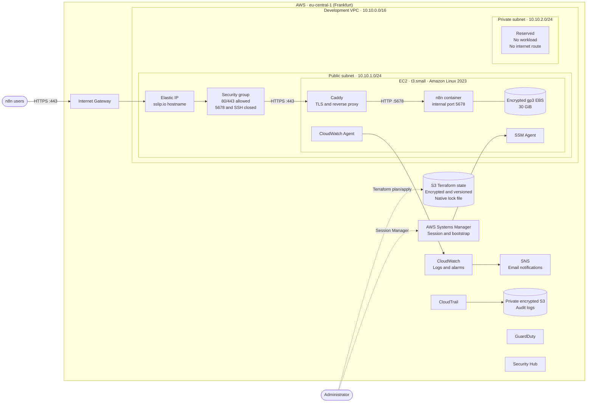

# Wusool Development Network Diagram

This diagram is derived from the Terraform configuration in
`environments/dev`, `modules/network`, and `modules/n8n-ec2`.

## Traffic flow

1. Users connect to the public `sslip.io` hostname over HTTPS.
2. The Internet Gateway routes traffic to the EC2 Elastic IP.
3. The security group permits HTTP and HTTPS traffic.
4. Caddy terminates TLS and proxies requests to n8n on internal port `5678`.
5. n8n stores persistent data on the encrypted EC2 root volume.

## Administration and monitoring

- Administrators connect through AWS Systems Manager; public SSH is disabled.
- CloudWatch collects logs and monitors EC2 status and CPU usage.
- SNS sends alarm notifications by email.
- CloudTrail stores audit logs in an encrypted, private, versioned S3 bucket.
- GuardDuty and Security Hub provide threat detection and security findings.

> This represents the architecture declared in Terraform, not a live AWS
> inventory.
