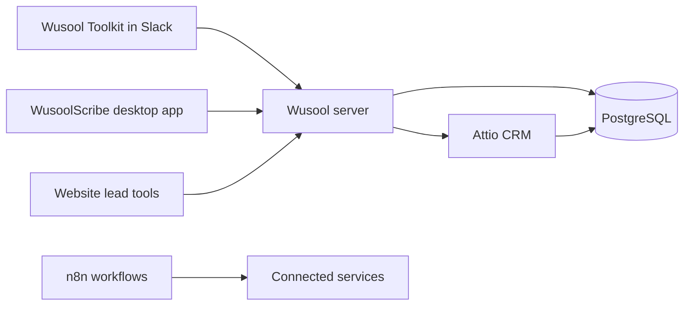

# Wusool Capital documentation

This is the client handbook for the Wusool platform. It explains how to use
each product, how the platform works, and how an engineering owner operates it.

## What do you need to do?

| I need to… | Start here |
| --- | --- |
| Find and manage buyers or sellers in Slack | [Use Wusool Toolkit](user-guide/toolkit.md) |
| Install, record, or push a meeting from WusoolScribe | [Use WusoolScribe](user-guide/scribe.md) |
| Find Toolkit or website-tool records in Attio | [Use Attio](user-guide/attio.md) |
| Understand a website valuation, readiness, benchmark, or buyer form | [Use the website lead tools](user-guide/lead-tools.md) |
| Use the hosted workflow service | [Use n8n](user-guide/n8n.md) |
| Fix a user-facing problem | [Troubleshooting and support](user-guide/troubleshooting.md) |
| Understand the whole platform | [Technical documentation](technical/README.md) |
| Deploy, monitor, recover, or take ownership | [Operations and handover](operations/README.md) |
| Check what is live or still open | [Delivery status](operations/delivery-status.md) |

## Products and data flow

- **Wusool Toolkit** finds buyer–seller matches and manages CRM profiles from Slack.
- **WusoolScribe** records and transcribes meetings on the user’s computer and can send a transcript for a CRM-ready summary.
- **Website lead tools** collect valuation, readiness, benchmarking, and buyer network submissions from wusoolcapital.com.
- **Attio and PostgreSQL** hold the business records used by the products.
- **n8n** hosts internal workflow automation.

Start with the [User Guide](user-guide/README.md) for day-to-day work. The
[Technical Documentation](technical/README.md) is written for a CTO or
engineer reviewing the design. The [Operations and Handover](operations/README.md)
section is the runbook for whoever owns the platform.
