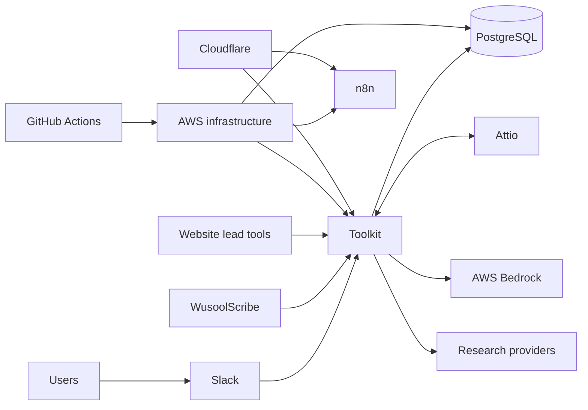

# Ownership and service dependencies

The repository defines technical boundaries but does not name the client people
accountable for them. Complete the `Client owner` column during handover and keep
it current in the client's operations register.

| System | Responsibility | Client owner | Escalation dependency |
| --- | --- | --- | --- |
| GitHub and Actions | Source control, checks, deployment history | Unassigned | GitHub service/support |
| AWS infrastructure | Network, compute, RDS, ECR, Systems Manager, logs, alarms, secrets | Unassigned | AWS support |
| Toolkit application | Slack commands, matching, enrichment, lead-tool APIs | Unassigned | AWS, Slack, Attio, data providers |
| PostgreSQL and CRM sync | Schema, migrations, webhook and nightly reconciliation | Unassigned | AWS RDS and Attio |
| Attio | CRM structure, data quality, users, webhook configuration | Unassigned | Attio support |
| Slack | Toolkit app configuration, workspace access, request routing | Unassigned | Slack support |
| n8n | Users, workflows, credentials, execution history | Unassigned | AWS host, email provider, n8n support |
| Cloudflare | Public DNS for service hostnames | Unassigned | Cloudflare support |
| WusoolScribe | Desktop release, update feed, local permissions, CRM submission | Unassigned | AWS update distribution and Toolkit API |

## Dependency map

An incident owner should follow the first failed boundary. Failed Slack
requests start with Slack request routing when Toolkit is healthy. Toolkit
database errors start with RDS reachability and credentials. Missing CRM
updates start with webhook/nightly execution and reconciliation.

## Handover completion checklist

- Assign a primary and backup owner for every row.
- Record the access-request and emergency contact route outside this public
  documentation.
- Confirm billing and renewal ownership for every vendor.
- Confirm alert recipients and an acknowledgement expectation.
- Confirm where incident, change, recovery-test, and data-reconciliation records
  are stored.
- Remove departing suppliers and staff from every system and rotate shared
  credentials according to the client's policy.

**Expected outcome:** an incident can be routed to a named person and vendor
without relying on the original delivery team. If any owner or access route is
missing, record it as an open handover item and escalate to the client sponsor.
