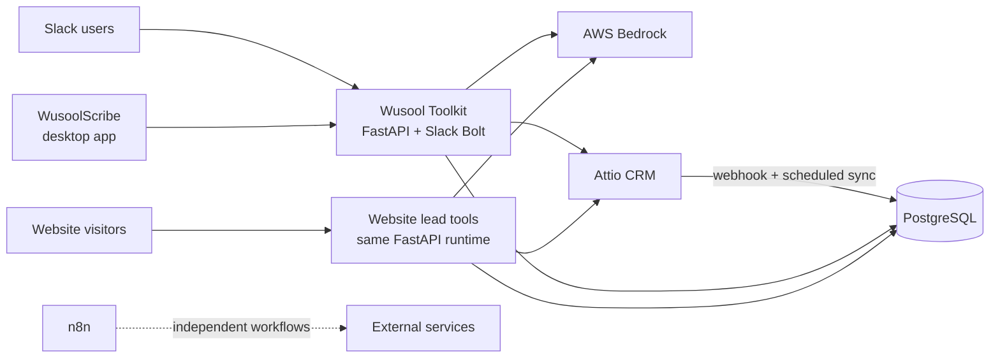

# Platform architecture

This section is the engineering reference for the Wusool platform. Each tool
has one page covering its purpose, runtime, data flow, configuration,
interfaces, and failure behavior.

## System at a glance

The Toolkit backend is a Python modular monolith: one FastAPI process hosts
the Slack bot, desktop API, Attio webhook, health endpoints, and website lead
tools. Its modules use inward-facing `domain → application → persistence →
providers → api` boundaries, enforced by architecture tests. PostgreSQL stores
the operational mirror and application records; Attio remains the CRM of
record for organizations, roles, and notes.

WusoolScribe is a separately distributed Tauri desktop application. n8n is a
separate, self-hosted vendor application. OpenTofu manages the AWS network,
compute, database, secrets, alarms, and Scribe update feed.

## Technical references

| System | Reference |
| --- | --- |
| Slack matching, profile management, enrichment, and discovery | [Wusool Toolkit](toolkit.md) |
| Desktop recording, transcription, summaries, and CRM push | [WusoolScribe](scribe.md) |
| Attio ↔ PostgreSQL synchronization | [Attio and database sync](attio-sync.md) |
| Valuation, Readiness, Benchmark, and Buyer Network | [Website lead tools](lead-tools.md) |
| Workflow automation runtime | [n8n](n8n.md) |
| Trust boundaries, credentials, and data handling | [Security and data handling](security.md) |

## Shared deployment model

Infrastructure is split into OpenTofu stacks: `account`, `base`, `toolkit`,
`n8n`, `postgres`, `peering`, and `scribe-updates`. Environment stacks keep
separate remote state for development and production. Runtime secrets live in
AWS Secrets Manager; committed `tfvars` files contain non-secret settings.

Toolkit runs as a container on an EC2 Auto Scaling Group of desired size one,
fronted by Caddy. n8n runs with Caddy and external task runners on its own EC2
instance. RDS accepts database traffic only from the application security
groups. Administrative access uses AWS Systems Manager; public application
traffic terminates on HTTPS.

For deployment, recovery, access, and incident procedures, use the Operations
and Handover section rather than the tool references.
