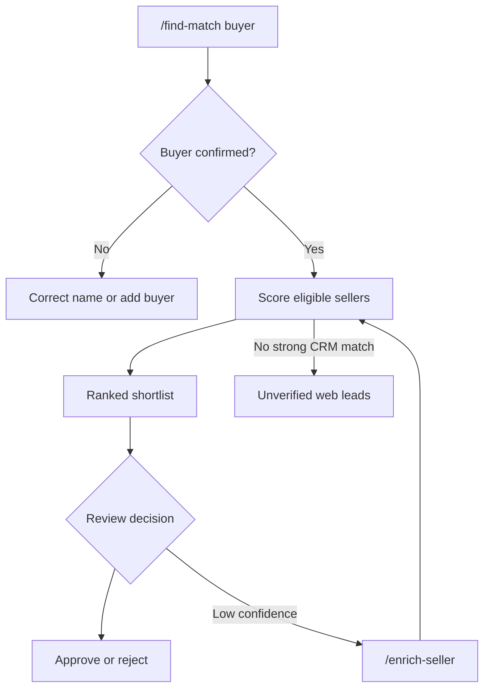
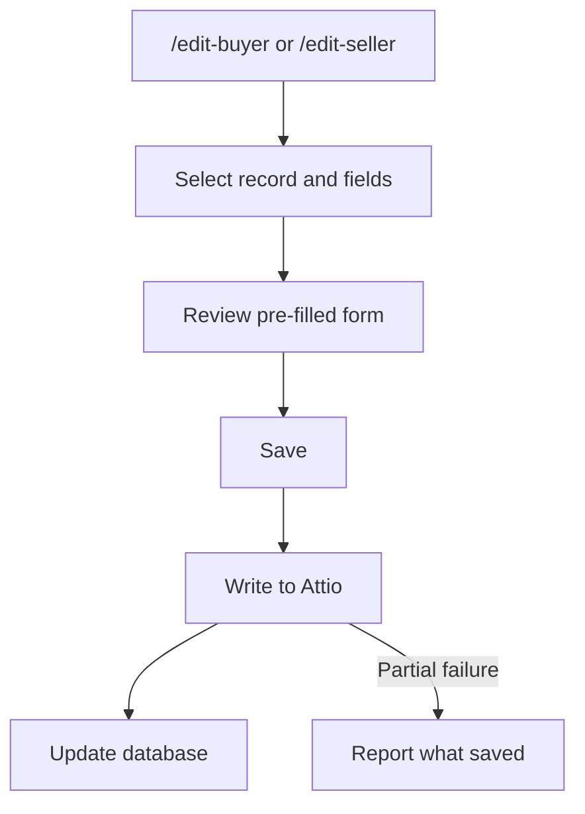
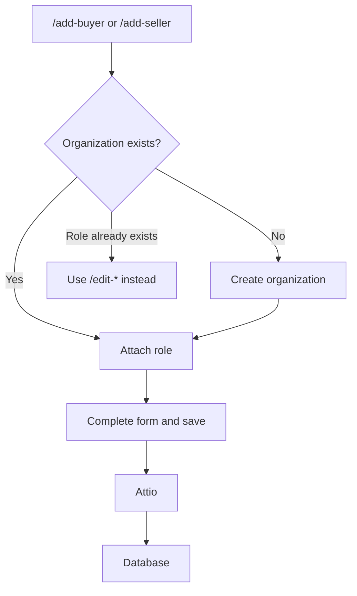
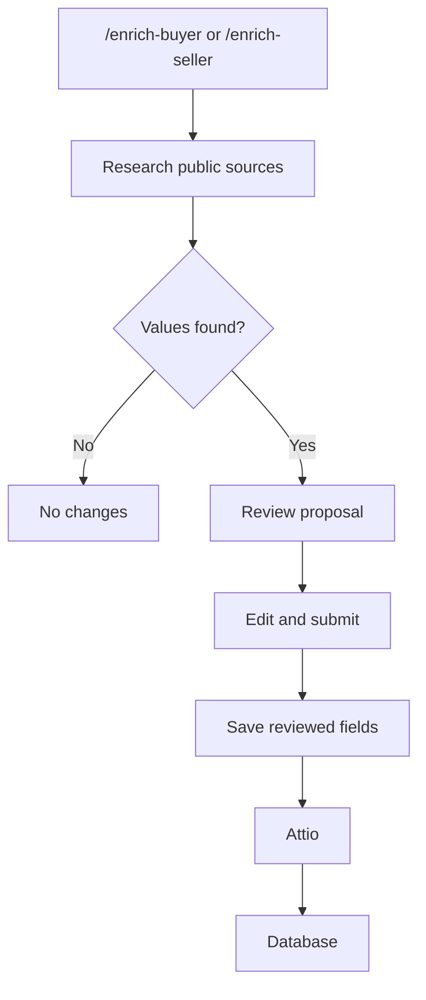

# Wusool Toolkit

Wusool Toolkit is the deal team's Slack bot. Use it to find buyer–seller
matches, maintain buyer and seller profiles, and research missing details.
There is no separate website or login.

## Before you start

- Join the Slack workspace and a channel or direct message where the bot is
  present.
- Type `/toolkit-help` in Slack to see the available commands.

The main workflows are matching, editing, adding, and enrichment. Use
`/toolkit-status` for service, database, and Attio-mode status, and
`/toolkit-help` for command help.

## Find matches

1. Run `/find-match <buyer name>`, for example `/find-match Raoof Capital`.
2. If several buyers have similar names, select the intended record. If none
   appears, check the spelling or add the buyer first.
3. Wait while the Toolkit compares eligible sellers. It returns a ranked
   shortlist with a fit score, data-confidence score, and explanation.
4. Use **View Full Analysis** to inspect the reasoning.
5. Choose **Approve Match** or **Reject Match** when you have decided.

**Expected result:** Slack shows one or more scored sellers. The fit score
combines factors such as strategy, size, and sector. Confidence describes how
much supporting CRM data was available. A high score with low confidence
needs human verification.

If no CRM seller clears the internal threshold, the bot can show up to three
unverified leads from a public web search. **Add as seller** opens the normal
add-seller flow; the lead is not saved until you complete that flow. **Find
more sellers** repeats the public search.

Match results never contact an organization or change its profile or deal.
Approval and rejection record the decision only. The bot rechecks current
data before saving a decision made from an older Slack message.

### If matching does not work

- **Buyer not found:** use the exact Attio name or add it with `/add-buyer`.
- **Thin or low-confidence result:** run `/enrich-buyer` or
  `/enrich-seller`, review the proposal, and match again.
- **No strong CRM match:** treat web leads as unverified and review their
  source before adding one.
- **Error or timeout:** avoid repeatedly submitting changes. Check
  `/toolkit-status`, then use [Troubleshooting](troubleshooting.md).

## Maintain buyer and seller records

### Edit an existing profile

1. Run `/edit-seller <name>` or `/edit-buyer <name>` and select the intended
   record if asked.
2. Tick only the organization or profile fields you need to change.
3. Continue to the pre-filled form, update the values, and press **Save**.

**Expected result:** the bot confirms the update. It writes to Attio first
and then to the database. A partial-failure message states what was and was
not saved.

System-managed scores and pipeline values do not appear in the form. People
references, such as owner or key contact, are not editable from Slack.
`Intake source` requires the correction checkbox before it can be changed.

### Add a buyer or seller

1. Run `/add-seller <organization name>` or `/add-buyer <organization name>`.
2. Select an existing organization if it is the same business. Otherwise
   choose **None of these — create new organization**.
3. Complete the form. A new organization requires a name; other fields can be
   filled later.
4. Review duplicate warnings and press **Save**.

**Expected result:** the organization, when new, and its buyer or seller role
are created in Attio and then the database. If the organization already has
that role, edit it instead. Two simultaneous add requests can create a
duplicate, so coordinate bulk entry.

There is no `/remove-seller` or `/remove-buyer`. Ask the CRM owner to handle
role removal.

## Research missing details

1. Run `/enrich-seller <name>` or `/enrich-buyer <name>` and select the
   intended record if asked.
2. Wait for the background research. The bot lists proposed values with
   confidence levels.
3. Press **Review & Save**, correct or clear anything you do not want, and
   submit the normal edit form.

**Expected result:** only reviewed values you submit are saved. A proposal
never changes Attio by itself, and existing non-empty fields are left alone.

## Rules to remember

Records created directly in Attio are copied to the database. Generated scores,
explanations, and researched values are decision support; a person remains
responsible for checking each result.
