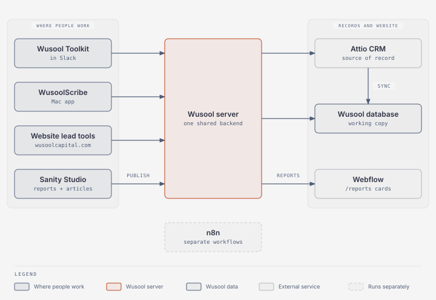

# Start here

This is the client handbook for the Wusool platform. It explains how to use each product, how the platform works, and how an engineering owner operates it.

## What do you need to do?

| I need to…                                                          | Start here                                                       |
| ------------------------------------------------------------------- | ---------------------------------------------------------------- |
| Find and manage buyers or sellers in Slack                          | [Use Wusool Toolkit](user-guide/toolkit.md)                      |
| Install, record, or push a meeting from WusoolScribe                | [Use WusoolScribe](user-guide/scribe.md)                         |
| Find a company, deal, or website lead in Attio                      | [Use Attio](user-guide/attio.md)                                 |
| Understand a website valuation, readiness, benchmark, or buyer form | [Use the website lead tools](user-guide/lead-tools.md)           |
| Publish a gated report or Insights article                          | [Publish in Sanity](user-guide/publish-in-sanity.md)             |
| See what changed in WusoolScribe                                    | [Scribe changelog](release-notes/scribe-changelog.md)            |
| Use the hosted workflow service                                     | [Use n8n](user-guide/n8n.md)                                     |
| Fix a user-facing problem                                           | [Troubleshooting and support](user-guide/troubleshooting.md)     |
| Understand the whole platform                                       | [Technical documentation](technical-documentation/technical.md)  |
| Deploy, monitor, recover, or take ownership                         | [Operations and handover](operations-and-handover/operations.md) |
| Check what is live or still open                                    | [Delivery status](operations-and-handover/delivery-status.md)    |

## Products and data flow

* **Wusool Toolkit** finds buyer–seller matches and manages CRM profiles from Slack.
* **WusoolScribe** records and transcribes meetings on your Mac and files the finished meeting in Attio as a note.
* **Website lead tools** collect valuation, readiness, benchmark, buyer network and Get Started submissions, and gate reports, on wusoolcapital.com.
* **Sanity Studio** is where the team writes and publishes reports and Insights articles.
* **Attio** is the source of record. The Wusool database keeps a working copy for the products.
* **n8n** hosts internal workflow automation.

Start with the [User Guide](user-guide/user-guide.md) for day-to-day work. The [Technical Documentation](technical-documentation/technical.md) is written for a CTO or engineer reviewing the design. The [Operations and Handover](operations-and-handover/operations.md) section is the runbook for whoever owns the platform.
