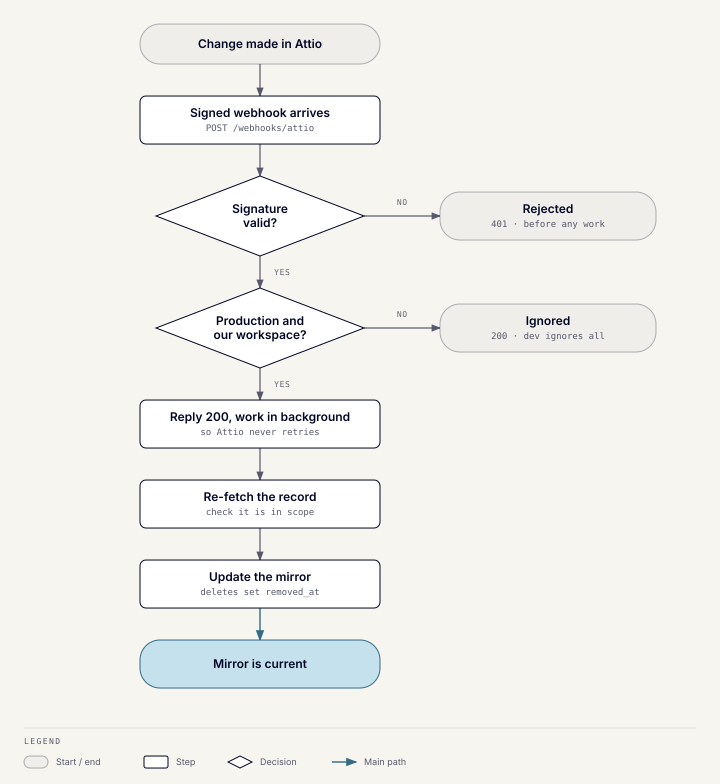
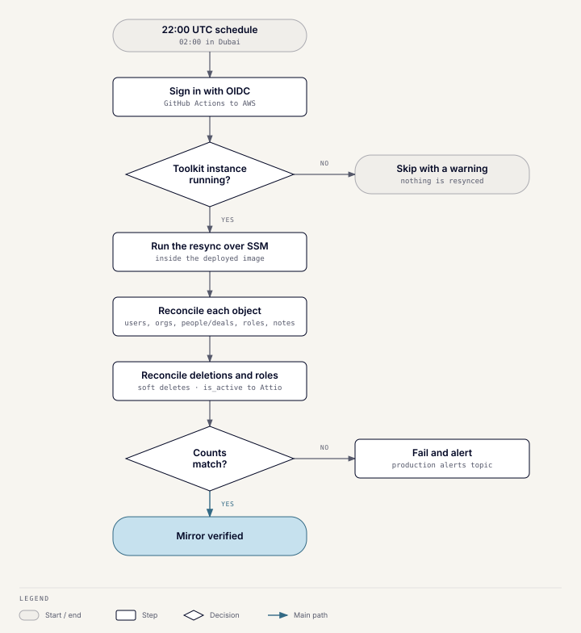

# Attio and database sync

## What it does

Attio is the CRM of record. PostgreSQL (`wusool_crm`) is the application's
mirror of it, used for matching, Toolkit workflows, meetings, and lead-tool
bookkeeping. Two mechanisms keep the mirror current: a real-time webhook and a
nightly full resync.

## Test and production records

There is one Attio workspace. Every system-created record carries an
`is_test` flag, and an **unset flag counts as production**: records created
before the flag existed have none.

- **Production** ingests webhooks and runs the nightly resync, skipping test
  records.
- **Development** ignores every Attio webhook, returning 200 so Attio keeps
  the subscription. The resync refuses to run in test mode. The development
  database is a hand-seeded sandbox, not a mirror.

## The webhook

`POST /webhooks/attio` is the only public sync endpoint.

1. The Attio signature is checked; a bad one returns 401, and a malformed
   payload returns 400.
2. Events from another workspace are dropped with a warning, still returning
   200. Events with no workspace ID pass through.
3. The endpoint returns 200 at once and processes events in the background.
   Each event re-fetches its record from Attio and checks it belongs to this
   environment's side.

| Attio event | Mirrored to |
| --- | --- |
| `record.*` for organizations | `organizations` |
| `record.*` for people | `person` |
| `record.*` for deals | `deals` (Attio's current deal object, not the legacy one) |
| `record.*` for notes | `notes` |
| `list-entry.*` for buyer and seller roles | `buyer_roles`, `seller_roles` |

Webhook updates also write `activities`. Every other event is ignored.

## Deletions

Records are deleted only in Attio. A `*.deleted` event sets the mirrored
row's `removed_at` timestamp instead of deleting it, because matches, notes,
and tool runs reference these rows. A record re-created in Attio comes back
live. Notes use `notes.attio_id` to tell Attio-created notes apart from local
ones whose Attio push failed. Only notes with a known Attio ID take part in
deletion reconciliation.

## The nightly resync

- **When:** every day at 22:00 UTC (02:00 in Dubai), and on demand from the
  workflow.
- **How:** the `nightly-attio-sync` workflow signs in to AWS through OIDC,
  then uses SSM to run the resync inside the already-deployed Toolkit
  container image. RDS is private, so only the Toolkit instance can reach it.
  The job has a 15-minute timeout.
- **Order:** users, then organizations, then people and deals in parallel,
  then roles, then notes, in pages of 500.
- **Writes back to Attio:** role reconciliation sets the `is_active` flag in
  Attio when an organization has more than one entry for the same role.
- **Guards:** an empty listing from Attio is never treated as "delete
  everything", and the final count check runs after deletion
  reconciliation.

If no Toolkit instance is running, the job warns and skips. A failure alerts
the production infrastructure topic.

## Writes from the Toolkit

- Profile commands write Attio first, then PostgreSQL, so the next sync agrees
  with what was stored.
- Lead tools write Attio only and let the mirror follow.
- Scribe meetings create an Attio note, with or without an organization.

## Failure behavior

- An Attio-first write can partly succeed across several records; the
  Toolkit reports what landed, and the sync converges the rest.
- A PostgreSQL-only edit to a mirrored field is overwritten by the next
  resync. Fix data in Attio.
- If Attio shows a change but PostgreSQL doesn't, note the record ID, field,
  value, and edit time. Then check webhook processing and the last resync
  before touching the database.
- If the resync fails, keep the workflow run URL and logs, and confirm no
  empty or partial page was accepted before retrying.
- The notes backfill script is dry-run by default and must never guess an
  Attio ID from a local UUID.

Runbooks in the repository: `docs/runbooks/attio-sync-failure.md`,
`docs/runbooks/database-and-migration-failure.md`, and
`docs/runbooks/deployment-failure-and-rollback.md`.

## Schema changes

PostgreSQL changes go through reviewed Alembic migrations; runtime code never
alters tables. Attio schema changes need the mapping, validation, and CRM
schema documentation updated together.

## Code

`server/app/modules/attio` (client and value handling) and
`server/app/modules/ddl_commands` (webhook, mirror, and the resync script).
The workflow is `.github/workflows/nightly-attio-sync.yml`. Migration-era
scripts are under `infrastructure/crm-sync` and `server/scripts/postgres-sync`.
