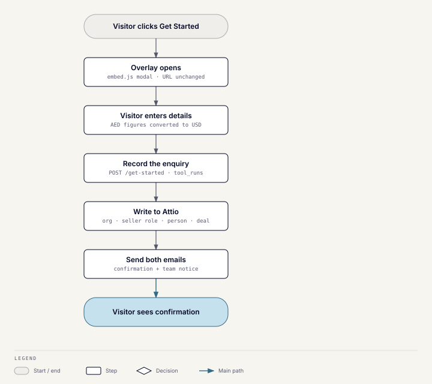

# Get Started

## What it does

The site's main "Get Started" button opens a short seller enquiry form. It
is pure lead capture: nothing is calculated and no AI is used. It replaced a
Tally popup.

## How it works

1. The form opens as an overlay through `embed.js`'s modal mode, so the page
   layout and URL don't change.
2. It collects name, company, email, geography, sector, revenue, EBITDA,
   years active, and selling timeline, plus consent. Choosing "Other" for
   sector reveals a free-text field.
3. `POST /get-started` records it through the
   [write contract](lead-tools.md#the-write-contract). The form collects
   AED and converts to USD in the browser; the server stores the USD figures
   on the seller role as received.
4. The visitor gets a confirmation email with a Book a Call link; the team
   gets a notice with the figures.

The sector list is the form's own wording, mapped to the CRM's sector
options. An unmapped value raises an error rather than guessing. The timeline
options match the seller role's options in Attio.

## Code

`server/app/modules/lead_magnets`: the `get_started` folders under `domain`
and `api`, and `static/get-started`.
