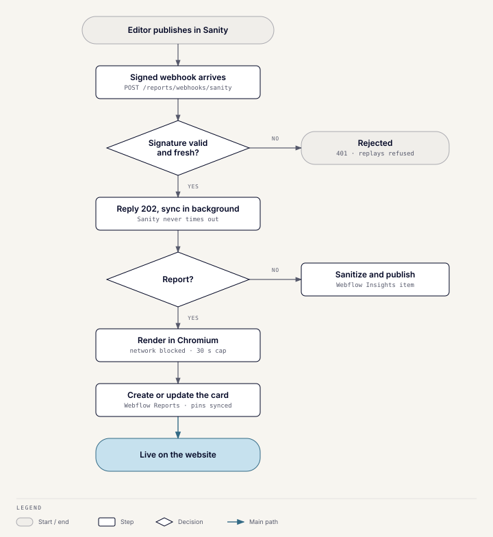

# Sanity and Webflow publishing

## What it does

Editors write gated reports and Insights articles in the Wusool Reports
Studio (Sanity). Publishing there updates wusoolcapital.com automatically:
reports get a card in Webflow's Reports collection, and articles become
Webflow Insights items.

## How a report publish works

1. Sanity calls the signed **`POST /reports/webhooks/sanity`** webhook. The
   server replies 202 at once and syncs in the background, so Sanity never
   times out and retries. Signatures older than 10 minutes are rejected.
2. **Render.** Some exported reports draw their pages with JavaScript. The
   server opens each new version once in headless Chromium, with the network
   blocked, one render at a time, and a 30-second cap. It saves the drawn
   page and the preview cut back to Sanity. Readers are only ever served this
   stored copy. The cut follows the editor's **Free pages** setting: one by
   default, and never the last page. Changing it renders the report again.
3. **Rich text reports** become a styled A4 page first, cut at the editor's
   **Locked share** (75% by default). Then they follow the same path.
4. **Card.** The server creates or updates the report's card in Webflow's
   Reports collection. Its SEO title, description and share title come from
   the report's SEO tab, or the title and excerpt when blank. Cards go live without a Webflow site publish.

A failed sync is only logged; republishing the report repairs it. A newer
render always wins over an older one that finishes late. The webhook returns
503 until Sanity and Webflow credentials are all configured.

## Pins

Two pins are kept in step between Sanity and Webflow:

- **Pin to top of /reports**: the featured card.
- **Pin to home page banner**: the "Just released" bar on the home page.

Taking a pin unticks it on every other report, in Sanity first and then
Webflow. If two editors pin at once, the later edit wins. The server never
refills an empty pin: the `/reports` page shows the newest report instead,
and the banner shows nothing.

## Insights articles

The same webhook carries Insights articles, which aren't gated.

- Bodies, written as rich text or pasted HTML, are sanitized against an
  allow-list. Webflow's API would otherwise store scripts as-is.
- Items the server creates are marked as Sanity-managed. It never updates or
  unpublishes an item without that mark, so a hand-written article with the
  same slug is skipped.
- **Pin to top of /insights** works across hand-written and Sanity
  articles: a Sanity pin clears every other pin on the site.
- If the pinned article is unpinned, unpublished or deleted, and nothing
  else is pinned, the newest Sanity article takes the pin. With none, the
  newest hand-written one does.
- Hiding articles stays in Webflow.

## Known gaps

- Sanity's Free-plan dataset is public. This is an accepted risk, described
  in the Studio's README.
- The Studio README notes the webhooks were created disabled and without a
  secret. Check in Sanity that both are enabled and signed.
- Rendering adds headless Chromium to the server image, and a render peaks at
  about 300 MB of memory.
- A published report picks up changes to the report page's layout only when
  it is republished.

## Code

`server/app/modules/lead_magnets`: the `insights_report` and
`insights_article` folders under `application`, and the `sanity`, `webflow`,
and `chromium` providers. The Studio itself is in `sanity/` at the repo root.
