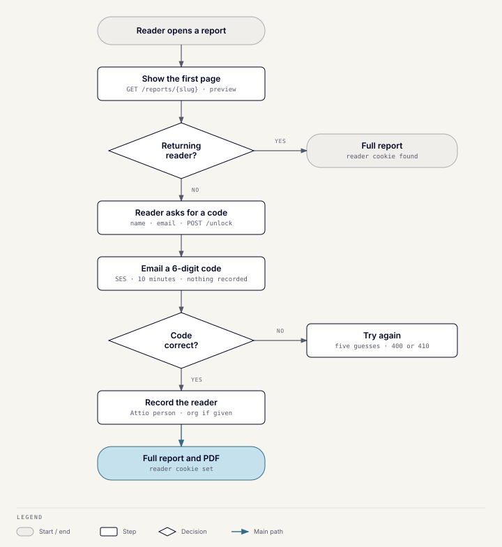

# Gated reports

## What it does

Reports live at `wusoolcapital.com/reports/<slug>`. A new reader sees the
first page, confirms their email with a 6-digit code, and then gets the full
report and a PDF. Only confirmed readers become leads.

## How it works

1. **`GET /reports/{slug}`** returns the stored report's preview to a new
   reader, or the whole report to a returning one. The preview is cut between
   block elements, never mid-tag, and never sends the rest to a new reader.
2. **`POST /reports/{slug}/unlock`** takes name, email, and an optional
   organization, and emails a one-time code through SES. Nothing is
   recorded yet, so a mistyped address never becomes a lead.
3. **`POST /reports/{slug}/unlock/verify`** checks the code. On a match it
   records the reader through the
   [write contract](lead-tools.md#the-write-contract), returns the whole
   report, and sets a reader cookie.
4. **`GET /reports/{slug}/pdf`** prints the stored report to A4 on each
   download. It returns 403 without a reader cookie.

A returning reader skips the form. Their first visit to a different report
records one more run, so every report a person reads becomes one activity.

## Codes

- A code lasts 10 minutes and allows five guesses. A wrong code returns 400;
  an expired, used, or unknown one returns 410.
- One inbox gets at most three codes per 10 minutes. Plus-addressing and
  Gmail dots count as the same inbox.
- Pending codes are held in memory, because one container runs. A deploy
  drops codes in flight, and those readers request a new one.
- The emailed code can be switched off by a server setting. The form then
  opens the report straight away and records the reader.

## CRM records

A reader becomes an organization (only if they gave one) and a person, with
no role and no deal. An existing organization is linked, not changed. Report
readers get no confirmation or team emails.

## Limits and failure behavior

- Page views and PDF downloads each have a per-IP hourly limit.
- Reports are cached for 5 minutes per process, up to 512 slugs, including
  misses.
- A report that hasn't been rendered yet returns 404, and so does every
  `/reports` route when Sanity isn't configured.
- PDFs share the renderer's one-at-a-time lock and 30-second cap. For a
  download, the 30 seconds include time spent waiting for the lock; a
  download still waiting then returns 503.

## Who read what

Every reader's first access to each report is one `tool_runs` row with the
report in its payload. Repeat visits to the same report aren't recorded. The
module README has a ready-made query.

## Code

`server/app/modules/lead_magnets`: the `insights_report` folders under
`domain`, `application`, and `api`, and `static/report`.
