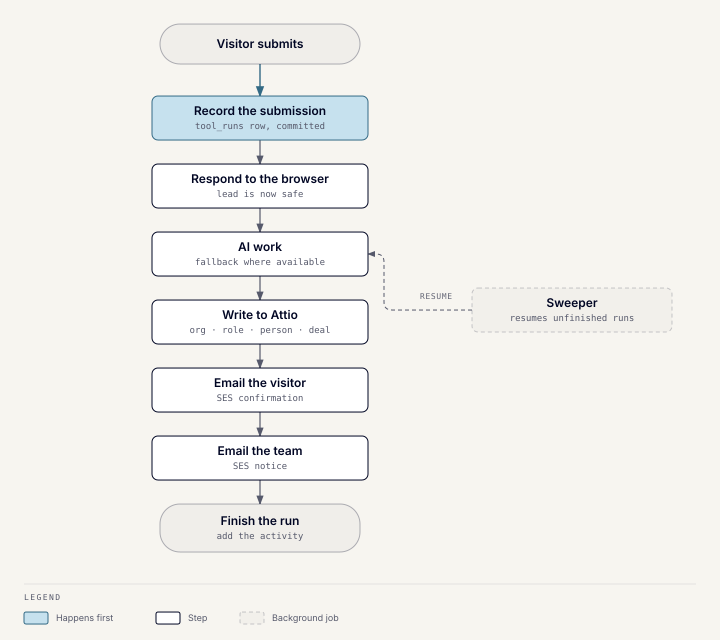

# Website lead tools

The `lead_magnets` module serves the public tools on wusoolcapital.com and the
gated reports behind `/reports`. It runs in the shared Toolkit server, on a
second hostname pointing at the same container. The sub-pages cover each tool.

| Tool | Result for the visitor | AI | Page |
| --- | --- | --- | --- |
| Valuation | A low, mid, and high valuation from blended methods | Chooses comparables and adjustments that feed the figures; built-in data is the fallback | [Valuation](lead-tools-valuation.md) |
| M&A Readiness | A 0–100 score, band, and recommendations | Required; there is no non-AI score | [M&A Readiness](lead-tools-readiness.md) |
| GCC SME Benchmark | Peer percentiles, a score, and an implied enterprise value | None | [GCC SME Benchmark](lead-tools-benchmark.md) |
| Buyer Network | Confirmation of the application | Optional internal note; never blocks | [Buyer Network](lead-tools-buyer-network.md) |
| Get Started | Confirmation of the seller enquiry | None | [Get Started](lead-tools-get-started.md) |
| Gated reports | The full report and a PDF, after an emailed code | None | [Gated reports](lead-tools-reports.md) |

Reports and Insights articles are published from Sanity; see
[Sanity and Webflow publishing](lead-tools-publishing.md).

## Embedding

Each tool page on wusoolcapital.com loads `embed.js`, which creates an iframe
and resizes it to fit. Adding `data-modal` and a `data-trigger` selector opens
the tool in an overlay instead; Get Started uses this to replace an old Tally
popup. Static pages are served under `/valuation/`, `/readiness/`,
`/benchmark/`, `/buyers/`, `/get-started/`, and `/report/`.

The tools hostname must stay DNS-only in Cloudflare, so edge caching never
delays an `embed.js` deploy or rollback.

## The write contract

Every tool that records a lead follows the same order, so a recorded lead is
never lost to a later failure:

1. **Record the submission** as a `tool_runs` row, committed before anything
   else happens.
2. **Respond** to the browser. Nothing that fails after this loses the lead.
3. **AI work**, where the tool has any. Valuation and Benchmark fall back to
   their own calculations; Readiness has no fallback by decision.
4. **Write to Attio**, always with the test flag set: the organization, a
   seller or buyer role, the person, and a deal at stage Inbound. The person
   and deal writes are best-effort: a failure is logged and not retried.
   Report readers get only an organization and a person.
5. **Email the visitor** a confirmation through Amazon SES, with a Book a
   Call link.
6. **Email the team** a notice linking to the Attio organization and deal.
7. **Finish** the run and add its activity.

Two tools record later than step 1 suggests. Valuation records nothing until
`/submit-lead`, after its AI calls; the page sends it once analysis settles or
the visitor leaves. Readiness calls the model before responding, so a failed
call leaves the run recorded but failed.

**The sweeper** runs every five minutes and resumes runs left unfinished for
more than five minutes, including failed emails. It gives up after one
attempt for a failed Readiness score, two for other AI failures, and six for
everything else. An abandoned run is logged as `lead_magnet_run_abandoned`
with no alarm, so it needs someone watching the logs.

The two emails are tracked as separate stages, so a resume never re-sends the
visitor's confirmation. An email step with no address configured is skipped
for good rather than retried.

The module writes placeholder organization and person rows, and an activity
row, to the database when a run finishes. Attio's webhook mirror then fills
in the full records.

## Duplicates

`tool_runs` is an append-only log: every genuine attempt gets its own row.
An exact network retry of the same request (same submission ID) reuses its
row instead of rerunning the pipeline. The CRM is where duplicates are
merged:

- **Organization:** found by a name search, and only treated as a match when
  the domain also matches. A submission with no domain, including a report
  reader with a free-mail address, always creates a new organization. A
  match is updated with the latest values.
- **Person:** matched by email. A match only gets blank fields filled; a
  name is never overwritten.
- **Deal:** one per organization per deal type, Sell-side or Buy-side. A
  matched deal is left untouched, so a new lead never moves a Qualified deal
  back to Inbound. If Attio rejects the deal for its owner, it is retried
  once with a fallback owner.

## Rules that fail silently if broken

- **Send USD, convert nothing.** Every destination is USD; a wrong
  conversion is off by 3.67× with nothing in the data to show it.
- **Always set the test flag.** A record without it disappears from both the
  test and production views in Attio.
- **Attio first.** A nightly job overwrites the database from Attio.

## Endpoints

| Endpoint | Purpose |
| --- | --- |
| `POST /enrich`, `POST /analyze`, `POST /compare` | Valuation report building; stateless |
| `POST /submit-lead` | Records the valuation |
| `POST /readiness/score` | Records and scores a Readiness submission |
| `POST /benchmark` | Records and scores a Benchmark submission |
| `POST /buyer/apply` | Records a Buyer Network application |
| `POST /get-started` | Records a Get Started enquiry |
| `GET /reports/{slug}`, `POST /reports/{slug}/unlock`, `POST /reports/{slug}/unlock/verify`, `GET /reports/{slug}/pdf` | Gated reports |
| `POST /reports/webhooks/sanity` | Sanity publish webhook |

| Response | Meaning |
| --- | --- |
| `403` | The request came from a website origin that isn't allowed |
| `422` | Invalid input |
| `429` | Rate limit reached |
| `500` | Bedrock failed in `/enrich`, `/compare`, or Readiness scoring |
| `401` | The Sanity webhook signature is invalid |

A repeat submission is never rejected; it is recorded as a new attempt.

**Rate limits** are per IP address per hour. The paid tool endpoints and
report code requests allow 20, report views and code checks 300, and PDF
downloads 30. They are held in memory, and the IP is taken from the last
`X-Forwarded-For` entry.

**Option lists.** An option the CRM doesn't know, such as an unexpected
selling timeline, fails the Attio write after the run is recorded. That lead
never reaches the CRM. Keep the form options in step with Attio.

## Failures and alerts

- Attio and stale-run failures are retried by the sweeper.
- An email that fails to send, after SES's own retries, raises a CloudWatch
  alarm on the Toolkit instance's log group. It uses the same alert topic as
  the other Toolkit alarms. The sweeper still tries again later, so an alarm
  doesn't always mean the email was lost.

## Code

`server/app/modules/lead_magnets` and its README; the tool pages are in its
`static` folder, with their own README. Alarms are defined in
`infrastructure/terraform/modules/toolkit-ec2`.
