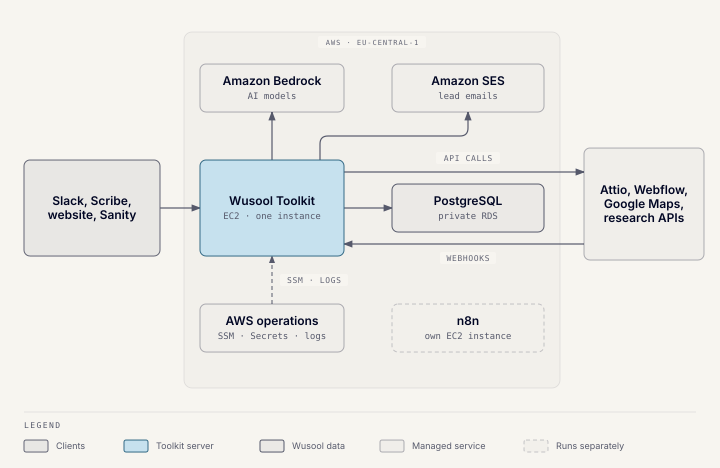
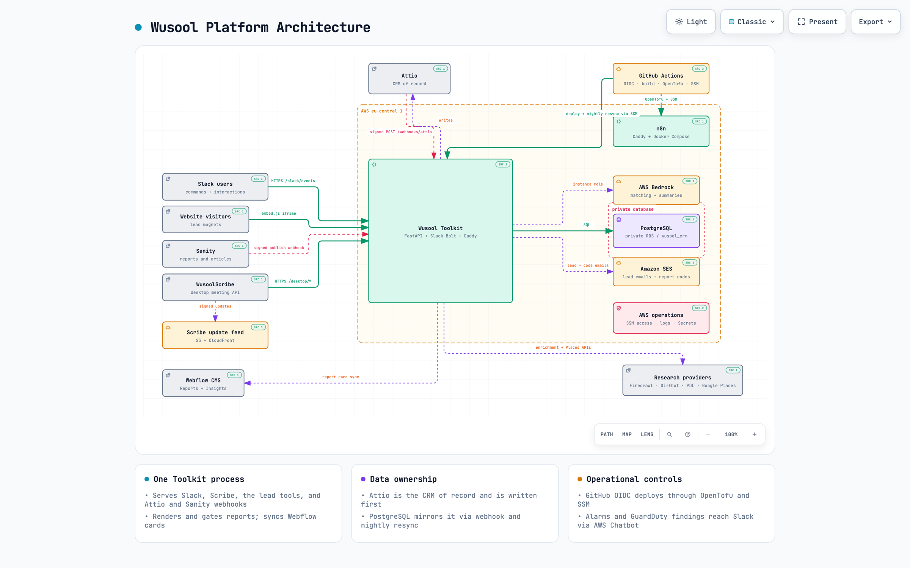

# Platform architecture

This section is the engineering reference for the Wusool platform. This page
shows how the pieces fit; each system then has its own page.

## Infrastructure at a glance

One Python process, the Wusool Toolkit, serves every product. It runs the
Slack bot, the WusoolScribe desktop API, the website lead tools and gated
reports, and the Attio and Sanity webhooks. It runs as a container behind Caddy on one EC2
instance. Its modules follow inward-only `domain → application → persistence
→ providers → api` layering, enforced by architecture tests.

- **Attio** is the CRM of record. The Toolkit writes to Attio first; a
  webhook and a nightly resync mirror Attio into PostgreSQL.
- **PostgreSQL** runs on private RDS, reachable only from the application
  security groups.
- **Amazon Bedrock** provides the AI models, and **Amazon SES** sends lead
  emails and report codes. Both are reached through the instance's IAM role.
- **Sanity** holds report and article content; the Toolkit publishes it to
  **Webflow**, which hosts wusoolcapital.com.
- **WusoolScribe** is a separately distributed Mac app, updated from an S3
  and CloudFront feed.
- **n8n** is a separate, self-hosted vendor application on its own instance.

## Detailed architecture

An interactive version is served from the Toolkit host, behind Basic Auth.
It adds search, focus, and links to the source code behind each component:

[Open the interactive architecture diagram](https://tools.wusoolcapital.com/architecture/)

Use the shared `architecture` username and the phrase stored in the Toolkit's
Secrets Manager secret. Never commit or paste the phrase into this
repository. The diagram's source is
`docs/internal/architecture/wusool-platform.architecture.json`.

## Technical references

| System | Reference |
| --- | --- |
| Slack matching, profile management, enrichment, and discovery | [Wusool Toolkit](toolkit.md) |
| Desktop recording, transcription, summaries, and CRM push | [WusoolScribe](scribe.md) |
| Attio ↔ PostgreSQL synchronization | [Attio and database sync](attio-sync.md) |
| Valuation, Readiness, Benchmark, Buyer Network, Get Started, and gated reports | [Website lead tools](lead-tools.md) |
| Workflow automation runtime | [n8n](n8n.md) |
| Trust boundaries, credentials, and data handling | [Security and data handling](security.md) |

## Shared deployment model

Infrastructure is split into OpenTofu stacks: `account`, `base`, `toolkit`,
`n8n`, `postgres`, `peering`, and `scribe-updates`. Environment stacks keep
separate remote state for development and production. `account`, `peering`,
and `scribe-updates` span environments, so they are applied separately from
the normal deploy. Runtime
secrets live in AWS Secrets Manager; committed `tfvars` files hold only
non-secret settings.

The Toolkit's Auto Scaling Group is fixed at one instance. Several features
rely on that: report codes, rate limits, and duplicate-delivery protection
are held in memory. n8n runs with Caddy and external task runners on its own
instance. Administrative access uses AWS Systems Manager, never SSH, and
public traffic terminates on HTTPS.

For deployment, recovery, access, and incident procedures, see
[Operations and handover](../operations-and-handover/operations.md).
