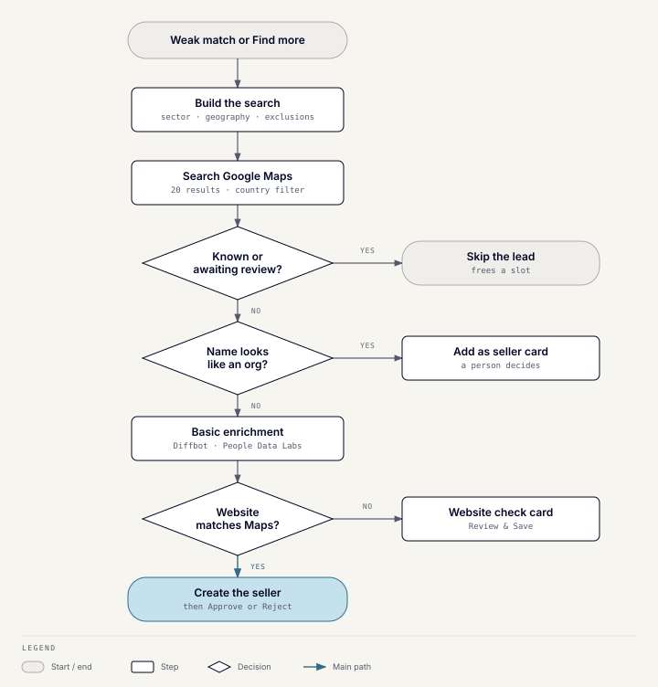

# Seller discovery

## What it does

When matching finds no strong CRM seller, discovery searches Google Maps for
companies that fit the buyer. It checks each against the CRM and adds the
verified new ones as sellers. People then approve or reject them like any
other match. Discovery never writes to the CRM itself: it hands every lead to
[profile commands](toolkit-profile-commands.md).

## When it runs

- **Automatically**, when every CRM candidate in a match scores below the
  discovery threshold.
- **On demand**, with **Find more sellers** on the match result.

Each match run searches once; a second trigger for the same run is ignored.
Each buyer role gets at most 10 searches a day. A search that fails or finds
nothing doesn't count. The cap is held in memory, so it resets on deploy.

## How it works

### 1. Build the search

The search terms come from the match run's extracted requirements:

- **Industry:** the first sector requirement.
- **Geography:** every geography value, combined, so the search covers the
  union of the buyer's regions and countries.
- **Exclusions:** every excluded sector, used later as a filter, because
  Google Maps search has no reliable "not" syntax.

If no sector or geography was extracted, the buyer's ideal-target
description or strategic thesis is used instead, cut to eight words. Maps
wants a type of business, not a sentence.

### 2. Search Google Maps

One Places Text Search call runs `"<industry> companies <geography>"`, with a
15-second timeout. It asks for up to 20 results, the same price as one, and
requests only the fields discovery needs: name, website, address, and
business type.

Geography is turned into a search area first:

- **GCC, MENA, and MENATP** resolve from a fixed country table. Geocoding
  them is actively wrong: "GCC" geocodes to a college in California.
- **"Global"** means no restriction.
- **Anything else** is geocoded live. Only real places are accepted
  (countries, regions, cities, or areas like "Middle East"), never a
  business that happens to share the name.

Results outside the resolved countries are dropped. A result with no country
is kept and logged, rather than discarded unchecked. Excluded sectors are
then filtered out by name and category.

### 3. Check each lead against the CRM

Leads are checked in order until five survivors are found:

| Check | Result |
| --- | --- |
| Same Google place ID as an organization | Skipped: already in the CRM |
| Same website domain (with or without `www.`) | Skipped: already in the CRM |
| Name resembles an organization (fuzzy match) | Not created; posted with **Add as seller** for a person to decide |
| Already waiting for a website review, flagged in the last 30 days | Skipped, so it isn't researched or posted twice |
| No match | Goes on to enrichment |

A skipped lead frees its slot for the next result.

### 4. Basic enrichment

New leads get the [basic enrichment tier](toolkit-enrichment.md#basic-tier):
Diffbot and People Data Labs only, given the company name and its Maps
domain. Two leads are researched at a time, within a 45-second budget for the
whole batch. A lead that runs out of time is created from its Google Maps
details alone and marked as such.

### 5. Check the website

Each provider whose data would be saved must report a homepage matching the
lead's Google Maps website. A match is the same host, ignoring `www.`, or a
subdomain of it. This catches a provider that resolved the name to a different company.

- **All match, or nothing from a provider is used:** the seller is created.
- **Any mismatch, or no website to compare:** nothing is written. The lead
  is stored for review instead.

Pages on shared platforms count as no website, because they name the
platform, not the company. These include Instagram, Facebook, LinkedIn,
Google Sites, WordPress.com, Wix, Squarespace, Salla, Zid, Shopify, and link
shorteners.

### 6. Create the seller

A verified lead becomes a new organization and seller role in one Attio-first
write, the same path `/add-seller` uses. The write happens under a lock that
re-checks the CRM first, so two leads from the same company can't both be
created. The Google place ID is saved on the organization, so later searches
skip it.

## What appears in Slack

| Message | What people can do |
| --- | --- |
| **Discovered sellers**, created and added to the match run | **Approve** or **Reject**. These sellers are labelled "Discovered via Google Maps; not scored". |
| **Possible duplicates** | **Add as seller** opens the add-seller form, prefilled, so a person can attach the lead to the existing organization or create a new one. |
| **Website check**, one per unverified lead | Shows both websites and the proposed values. **Review & Save** opens the prefilled add-seller form; it keeps working after a restart. |
| Failures and counts | Leads that failed to save, with anything that reached the CRM, plus counts of leads already in the CRM or awaiting review. |

## Approve or reject a discovered seller

**Approve** follows the normal approval path. It creates a Qualified Buy-side
deal in Attio for the buyer and seller, or offers to promote an existing
Inbound deal. It then starts **full enrichment** in the background, which
posts a research proposal for the new seller. Nothing from that proposal is
saved until someone uses **Review & Save**.

**Reject** marks the candidate rejected, recording who decided and when. The
seller stays in the CRM, because it was created when discovered. If it isn't
wanted at all, the CRM owner removes it in Attio.

| | Basic enrichment | Full enrichment |
| --- | --- | --- |
| **When** | While the lead is discovered | After a discovered seller is approved, or with `/enrich-seller` |
| **Sources** | Diffbot and People Data Labs | Diffbot, then People Data Labs, then a Firecrawl web search with Bedrock extraction |
| **Result** | Saved with the new seller, if the website check passes | A proposal only; saved after review |
| **Why** | Cheap, structured data is enough to create a lead | The costly web research is spent only on sellers someone wants |

## Data it reads and writes

Discovery owns one table, `discovery_reviews`, holding leads that are waiting
for a website review. Sellers themselves are written by profile commands.

## Failure behavior

- Without Google Places credentials, discovery is disabled and says so.
- If the review store is down, the lead's card uses a short-lived button
  instead, and that lead isn't deduplicated next time.
- Seller creation is serialized by an in-process lock, another reason the
  Toolkit runs as one instance.

## Code

`server/app/modules/discovery` and its README. The search terms are built in
`matching_engine/application/discovery_bridge.py`, and the seller write is in
`ddl_commands/providers/discovery`.
