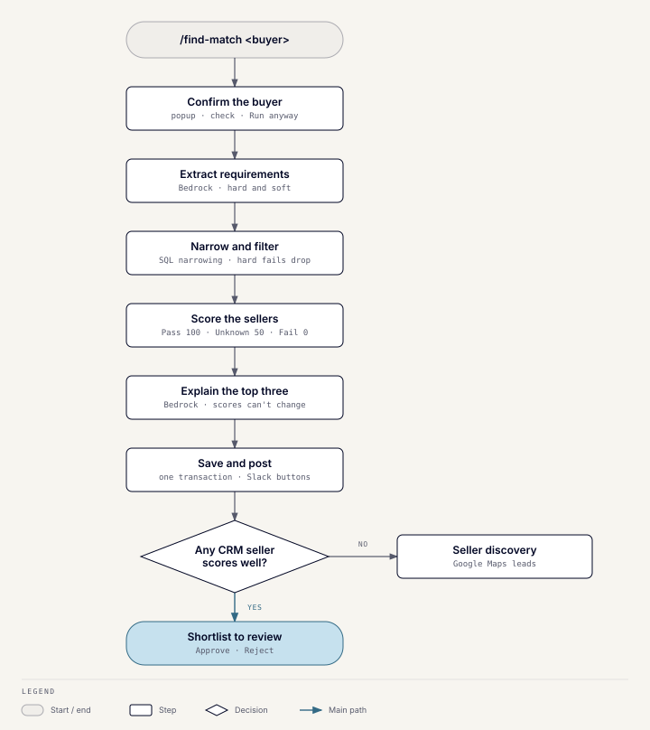
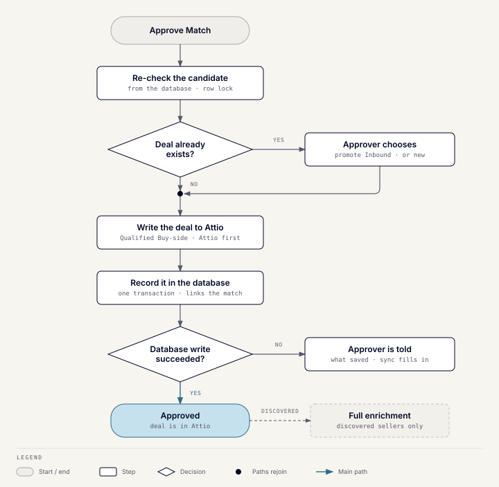

# Matching engine

## What it does

`/find-match <buyer>` produces a ranked seller shortlist for a buyer, explains
it, and lets an advisor approve or reject each candidate. Approving creates a
Qualified Buy-side deal in Attio.

## How it works

1. **Resolve the buyer.** A fuzzy name search finds the buyer, and a popup
   asks the advisor to confirm it, even when there is only one match.
2. **Check the buyer.** The [discrepancy check](toolkit-discrepancies.md)
   fills the same popup. The match starts when the advisor clicks **Run
   anyway**, which works even before the check has finished.
3. **Extract requirements.** One Bedrock call reads the buyer's CRM fields,
   free text, recent meeting notes, and the advisor's note. It returns hard
   requirements and soft preferences. A criterion the advisor restates
   replaces the stored one for this run. A ticket or EV limit counts only when
   the note names what it measures. A bare "up to 10M" sets no limit, and the
   result says so.
4. **Narrow and filter.** SQL narrows sellers by the buyer role's vertical,
   target region and country, and EV ceiling. A seller with no data for a
   dimension always passes. If any target region can't be resolved, or is
   unrestricted (such as Europe or Global), geography narrowing is skipped. A seller is then dropped only on a confirmed hard
   requirement's failure; missing data never eliminates anyone. Ticket size
   never eliminates; it only affects the score.
5. **Score.** Each criterion scores Pass 100, Unknown 50, or Fail 0, and the
   weighted average ranks the sellers. Data confidence (how much of the score
   rests on CRM data rather than AI inference) is reported separately and
   never changes the ranking.
6. **Explain.** The top three sellers form the shortlist. One Bedrock call
   writes reasoning for them. It can't change their scores, and its prompt
   tells it to use only the facts it was given.
7. **Save.** Scores, candidates, and the completed run are committed in one
   transaction, then posted to Slack with **Approve**, **Reject**, **View Full
   Analysis**, and **Find more sellers**.
8. **Discover.** If every candidate scores below the discovery threshold,
   [seller discovery](toolkit-discovery.md) runs automatically. Otherwise
   **Find more sellers** runs it on demand. Each run searches once.

Meeting notes reach both Bedrock calls as labeled, unverified context: always
for the buyer, and by default for shortlisted sellers.

## Approving a match

Approve and Reject re-read the candidate from the database rather than
trusting the Slack payload. A compare-and-set on its pending status stops two
people deciding the same candidate. Approve locks the candidate
row, so a double click can't create two deals.

Approve writes the Qualified Buy-side deal to Attio first, then records it in
the database in one transaction. If Attio already has a deal for that buyer
and seller, the approver chooses to promote it or create a new one. Only an
Inbound deal is promoted; later stages are left alone.

## Data it reads and writes

| Data | Use |
| --- | --- |
| `buyer_roles`, `seller_roles`, `organizations` | Read: buyer criteria and the seller pool. |
| `meetings` | Read: recent meeting notes as context. |
| `match_scores`, `match_results` | Written: one run and its candidates. |
| `deals` and the Attio deal | Written on approval. |

## Failure behavior

- If requirement extraction or reasoning fails, the run stops with an error
  instead of producing a partial result.
- If Attio accepts the deal but the database write fails, the approver is
  told what was saved. The Attio webhook or nightly resync fills in the
  database.
- Duplicate Slack deliveries are ignored for five minutes by an in-memory
  store. It works for one process only, which is one reason the Toolkit runs
  as a single instance; the auto-scaling group is fixed at one.

## Not built

Semantic search, document ingestion, outreach or email, and PDF output are
out of scope by design.

## Code

`server/app/modules/matching_engine` and its README.
