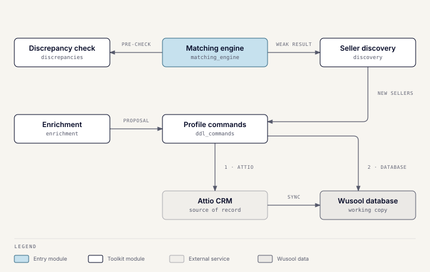

# Wusool Toolkit

Wusool Toolkit is the deal team's Slack bot. Every command runs in the shared
Toolkit server: one Slack app and one process, built from several modules that
hand work to each other. The sub-pages describe each module.

## Commands and modules

| Command | Module | Page |
| --- | --- | --- |
| `/find-match` | `matching_engine` | [Matching engine](toolkit-matching.md) |
| `/check-buyer` | `discrepancies` | [Discrepancy check](toolkit-discrepancies.md) |
| `/add-buyer`, `/add-seller`, `/edit-buyer`, `/edit-seller` | `ddl_commands` | [Profile commands](toolkit-profile-commands.md) |
| `/enrich-buyer`, `/enrich-seller` | `enrichment` | [Enrichment](toolkit-enrichment.md) |
| none (triggered by matching) | `discovery` | [Seller discovery](toolkit-discovery.md) |
| `/toolkit-status`, `/toolkit-help` | server | Health and usage help |

There are no remove commands and no public REST endpoints for match or
profile data.

## How the modules hand off work

- **Matching** runs the discrepancy check before every match, and starts
  seller discovery when no CRM seller scores well enough.
- **Discovery** never writes to the CRM itself. It asks Profile commands to
  create a verified lead, or to open the prefilled add-seller form.
- **Enrichment** never saves anything. Its proposal opens Profile commands'
  real edit form, so every save takes the normal write path.
- **Profile commands** writes to Attio first, then to the Wusool database.
  Matching writes to Attio directly in one case: approving a match creates
  the Qualified deal.

Modules only call each other through declared interfaces, wired together when
the server starts. Architecture tests in the repo fail the build if a module
reaches into another's internals.

## Shared runtime

| Interface | Behavior |
| --- | --- |
| `POST /slack/events` | Receives every Slack command and interaction; Slack Bolt verifies the signature. |
| `GET /health` | Process liveness, with no database dependency. |
| `GET /readiness` and `GET /ready` | Database readiness; returns 503 when the database is unreachable. |
| `POST /webhooks/attio` | Attio's change webhook; verified, then synced to the database in the background. See [Attio and database sync](attio-sync.md). |

The same process also serves the [WusoolScribe](scribe.md) desktop API and
the [website lead tools](lead-tools.md), and runs the lead tools' sweeper.

**Test and production records.** There is one Attio workspace. Development
stamps every record it creates as test data and refuses to edit production
records; production does the reverse. Development also ignores inbound Attio
webhooks.

**AI.** Matching, the discrepancy check, and enrichment call Amazon Bedrock.
Deployed environments reach it through the instance's IAM role, not static
keys.

## Shared modules

| Module | Responsibility |
| --- | --- |
| `organizations` | Organization search and persistence, shared by matching and profile commands. |
| `attio` | Attio API client, value conversion, notes, and webhook types. |
| `notifications` | Shared Slack message formatting and notifications. |
| `utilities` | Database wiring, logging, retries, and money handling. |

## Code

Each module lives in `server/app/modules/<module>` with its own README, which
is the most detailed reference. `server/main.py` merges the modules' Slack
handlers onto one app.
