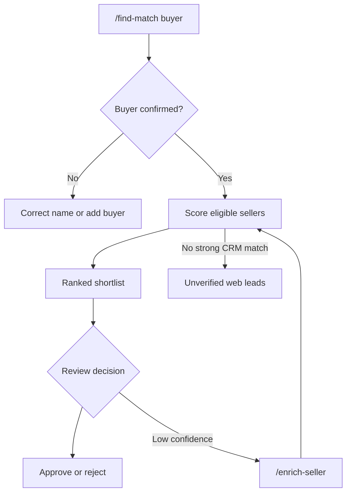
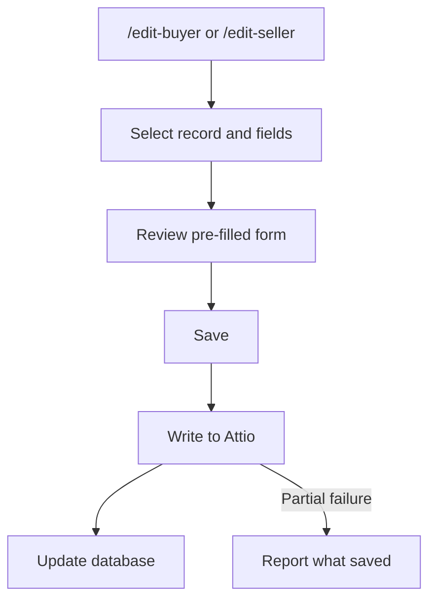
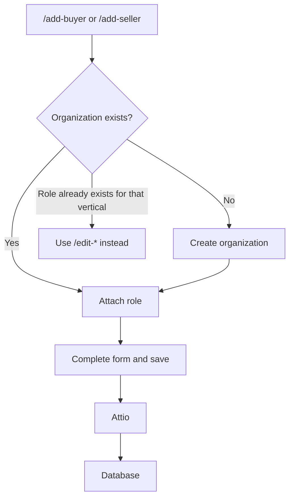
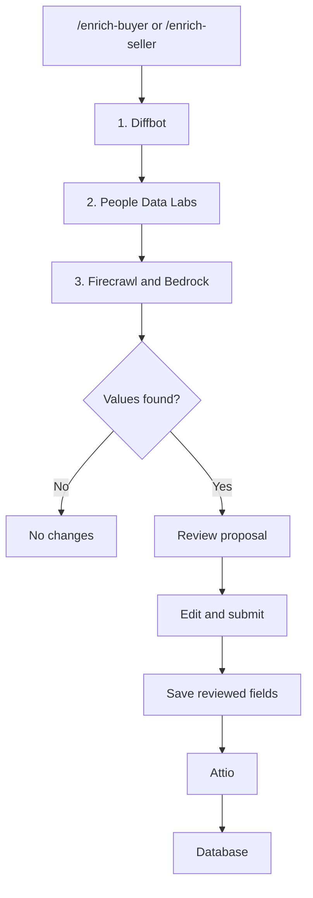

# Wusool Toolkit

Wusool Toolkit is the deal team's Slack bot. Use it to find buyer–seller
matches, maintain buyer and seller profiles, and research missing details.
There is no separate website or login.

## Before you start

- Join the Slack workspace and a channel or direct message where the bot is
  present.
- Type `/toolkit-help` in Slack to see the available commands.

| Command | Result |
| --- | --- |
| `/find-match <buyer name>` | Ranked seller shortlist |
| `/check-buyer <buyer name>` | Checks the buyer's criteria for conflicts or missing data |
| `/edit-seller <name>` / `/edit-buyer <name>` | Edit an existing profile |
| `/add-seller <organization>` / `/add-buyer <organization>` | Add a role |
| `/enrich-seller <name>` / `/enrich-buyer <name>` | Propose missing values |
| `/toolkit-status` | Environment, uptime, database, and Attio status |
| `/toolkit-help` | Command help |

## Find matches

1. Run `/find-match <buyer name>`, for example `/find-match Raoof Capital`.
2. If several buyers have similar names, select the intended record. If none
   appears, check the spelling or add the buyer first.
3. Wait while the Toolkit compares eligible sellers. It returns a ranked
   shortlist with a fit score, data-confidence score, and explanation.
4. Use **View Full Analysis** to inspect the reasoning.
5. Choose **Approve Match** or **Reject Match** when you have decided.

**Expected result:** Slack shows scored sellers with fit and data-confidence
scores. Verify high scores when confidence is low.

If no CRM seller clears the internal threshold, the bot can show up to three
unverified leads from a public web search. **Add as seller** opens the normal
add-seller flow; the lead is not saved until you complete that flow. **Find
more sellers** repeats the public search.

Match results never contact an organization or change its profile or deal.
Approval and rejection record only the decision, after a current-data check.

### If matching does not work

- **Buyer not found:** use the exact Attio name or add it with `/add-buyer`.
- **Thin or low-confidence result:** run `/enrich-buyer` or
  `/enrich-seller`, review the proposal, and match again.
- **No strong CRM match:** treat web leads as unverified and review their
  source before adding one.
- **Unexpected countries in web leads:** discovery searches worldwide
  unless the buyer's **Target geography** is set. Edit it with
  `/edit-buyer`.
- **Error or timeout:** avoid repeatedly submitting changes. Check
  `/toolkit-status`, then use [Troubleshooting](troubleshooting.md).

## Maintain buyer and seller records

### Edit an existing profile

1. Run `/edit-seller <name>` or `/edit-buyer <name>` and select the intended
   record if asked.
2. For a buyer, choose the vertical: pick one the organization already has a
   role for to edit it, or an unused one to create a new role.
3. Tick only the organization or profile fields you need to change.
4. Continue to the pre-filled form, update the values, and press **Save**.

**Expected result:** the bot confirms the update after writing to Attio and
then the database. Partial failures identify what saved.

System-managed scores, pipeline values, and people references are not editable
from Slack. `Intake source` requires the correction checkbox.

### Add a buyer or seller

1. Run `/add-seller <organization name>` or `/add-buyer <organization name>`.
2. Select an existing organization if it is the same business. Otherwise
   choose **None of these — create new organization**.
3. For a buyer, choose the vertical. An organization holds one buyer role per
   vertical, so an existing vertical opens that role for editing and an unused
   one creates a new role.
4. Complete the form. A new organization requires a name; other fields can be
   filled later.
5. Review duplicate warnings and press **Save**.

**Expected result:** the organization and role are created in Attio, then the
database. If the seller role, or the buyer role for that vertical, already
exists, edit it instead. Coordinate simultaneous adds.

There is no `/remove-seller` or `/remove-buyer`. Ask the CRM owner to handle
role removal.

## Research missing details

Research follows this three-tier waterfall:

1. **Diffbot** checks structured company data first.
2. **People Data Labs** checks organization fields Diffbot did not resolve.
3. **Firecrawl** searches public sources, then Bedrock extracts remaining values.

Each field keeps its first supported value; later tiers do not overwrite it.
Missing credentials skip that tier. Buyer-specific fields go directly to
Firecrawl because structured company providers do not cover them.

1. Run `/enrich-seller <name>` or `/enrich-buyer <name>` and select the
   intended record if asked.
2. Wait for the background research. The bot lists proposed values with
   confidence levels.
3. Press **Review & Save**, correct or clear anything you do not want, and
   submit the normal edit form.

**Expected result:** only reviewed values are saved. Proposals never change
Attio, and existing non-empty fields remain untouched.

## Rules to remember

Records created directly in Attio are copied to the database. Generated scores,
explanations, and researched values are decision support; a person remains
responsible for checking each result.
