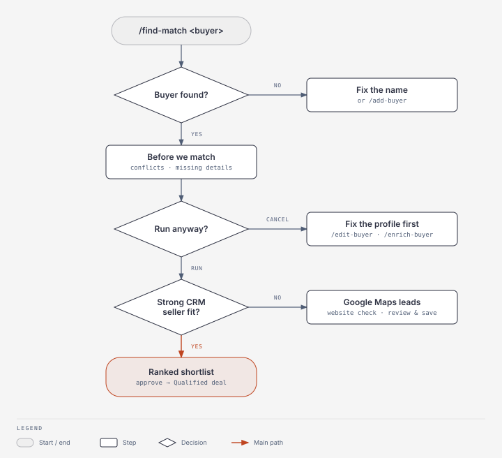
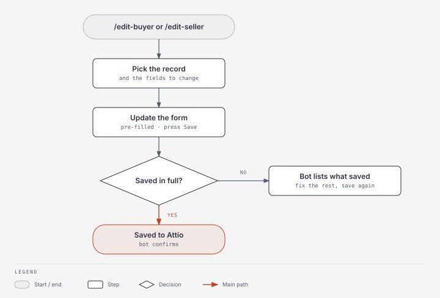
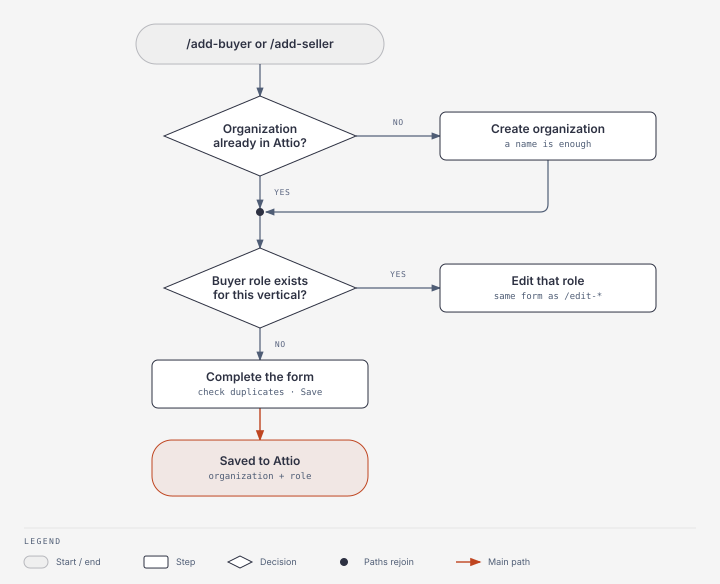
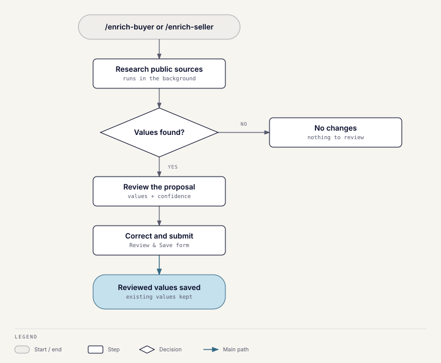

# Wusool Toolkit

Wusool Toolkit is the deal team's Slack bot. Use it to find buyer–seller
matches, maintain buyer and seller profiles, and research missing details.
Its scores and research are decision support; always check the result.

## Before you start

- Use the bot in a channel it's in (add it with `/invite @Wusool Toolkit`).
  It doesn't work in direct messages.
- Type `/toolkit-help` to see the available commands.

| Command | Result |
| --- | --- |
| `/find-match <buyer name>` | Ranked seller shortlist |
| `/check-buyer <buyer name>` | Checks the buyer's profile for conflicts or missing details |
| `/edit-seller <name>` / `/edit-buyer <name>` | Edit an existing profile |
| `/add-seller <organization>` / `/add-buyer <organization>` | Add a role |
| `/enrich-seller <name>` / `/enrich-buyer <name>` | Propose missing values |
| `/toolkit-status` | Checks the bot is healthy |
| `/toolkit-help` | Command help |

## Check a buyer before matching

1. Run `/check-buyer <buyer name>` and confirm the buyer.
2. Optionally describe what this search is for, for example
   `pharma tech only, UAE, $5-15M ticket`.

**Expected result:** a popup lists **conflicts** with the buyer's profile and
**missing details**, each naming the `/edit-buyer` field to fix. It ends with
how your note was read, for example "Read your note as: Pharmaceuticals /
Biotech · United Arab Emirates".

How your note is read:

- An amount counts as a ticket size only when you label it: "ticket",
  "check size", "investment", or "deal size".
- Open-ended amounts such as "at least $2M" conflict only when they can't
  overlap the buyer's range.
- Exclusions such as "no pharma" aren't checked.
- Geography uses the buyer's target regions and target countries together.

`/find-match` runs the same check before every match.

## Find matches

1. Run `/find-match <buyer name>`, for example `/find-match Raoof Capital`.
2. If several buyers have similar names, select the intended record.
3. In the **Before we match** popup, choose **Run anyway**, or **Cancel** to
   fix the profile first.
4. Use **View Full Analysis** to inspect a seller's reasoning, then choose
   **Approve Match** or **Reject Match**.

**Expected result:** a ranked shortlist with fit and data-confidence scores.
Check high scores carefully when confidence is low.

**Approve Match** creates a Qualified Buy-side deal in Attio for that buyer
and seller. If an Inbound deal already exists for the pair, the bot asks
whether to promote it to Qualified or create a new one. An approval can't be
undone from Slack; ask the CRM owner to change the deal in Attio. Matching
never contacts an organization.

### When no CRM seller is a strong fit

The bot searches Google Maps for new sellers in the buyer's target regions
and countries:

- A lead is saved automatically only when the company's website matches the
  one on Google Maps.
- Otherwise a **Website check** message shows both websites and the proposed
  values. **Review & Save** opens the add-seller form; nothing is saved until
  you complete it.
- A lead already waiting for review is skipped for 30 days.
- Pages on Instagram, Facebook, Shopify, Salla, Zid, or Google Sites count
  as "no website".

**Find more sellers** repeats the search.

### If matching does not work

- **Buyer not found:** use the exact Attio name or add it with `/add-buyer`.
- **Thin or low-confidence result:** run `/enrich-buyer` or
  `/enrich-seller`, review the proposal, and match again.
- **Unexpected countries in web leads:** set the buyer's target regions or
  countries with `/edit-buyer`.
- **Error or timeout:** check `/toolkit-status`, then see
  [Troubleshooting](troubleshooting.md).

## Maintain buyer and seller records

### Edit an existing profile

1. Run `/edit-seller <name>` or `/edit-buyer <name>` and select the intended
   record if asked.
2. For a buyer, pick a vertical. An existing one edits that role.
3. Tick only the organization or profile fields you need to change.
4. Continue to the pre-filled form, update the values, and press **Save**.

**Expected result:** the bot confirms the update once it is saved to Attio.
If only part of it saved, the bot says which part.

Scores, pipeline values, and people references can't be edited from Slack.
`Intake source` requires the correction checkbox.

### Add a buyer or seller

1. Run `/add-seller <organization name>` or `/add-buyer <organization name>`.
2. Select an existing organization if it is the same business. Otherwise
   choose **None of these — create new organization**.
3. For a buyer, pick a vertical. An organization can hold one buyer role per
   vertical: an existing one edits that role, and an unused one creates a new
   role.
4. Complete the form. A new organization only needs a name; other fields can
   be filled later.
5. Review duplicate warnings and press **Save**.

**Expected result:** the organization and role appear in Attio.

There is no `/remove-seller` or `/remove-buyer`. Ask the CRM owner to remove
a role in Attio.

## Research missing details

1. Run `/enrich-seller <name>` or `/enrich-buyer <name>` and select the
   intended record if asked.
2. The bot researches public company sources and lists proposed values with
   confidence levels.
3. Press **Review & Save**, correct or clear anything you don't want, and
   submit the normal edit form.

**Expected result:** only reviewed values are saved. Fields that already
have a value are never overwritten.
